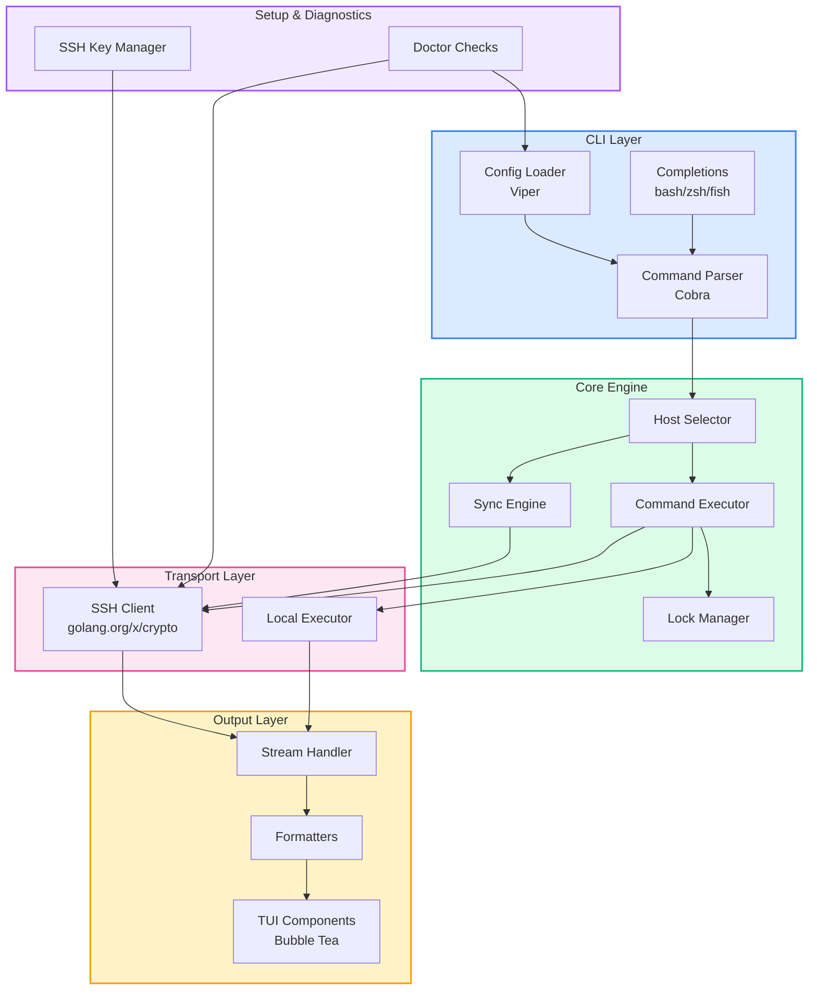
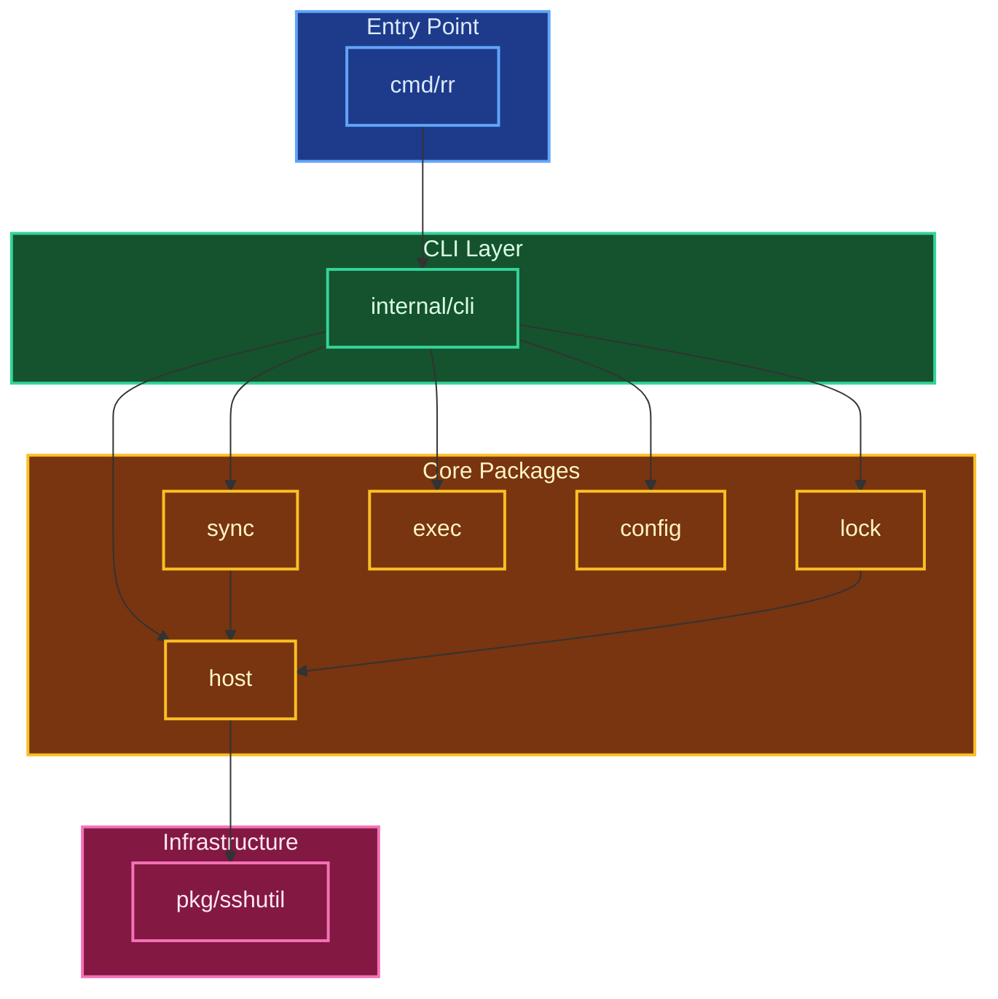
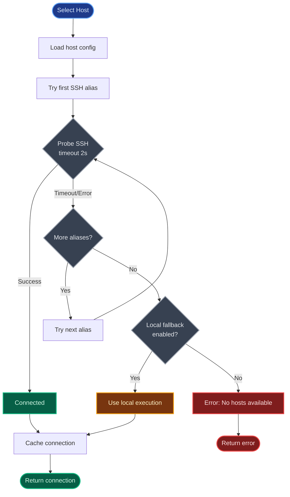
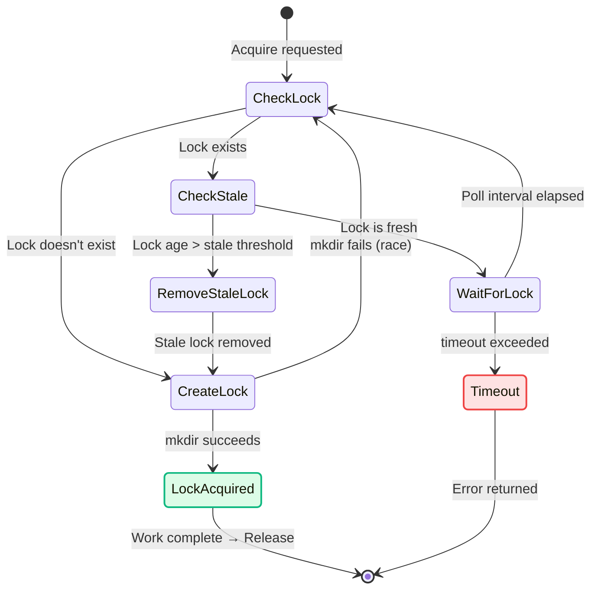
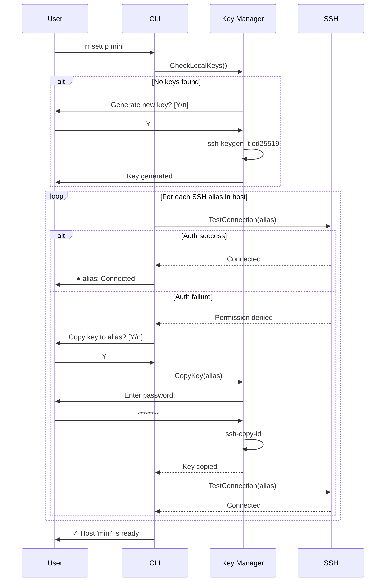
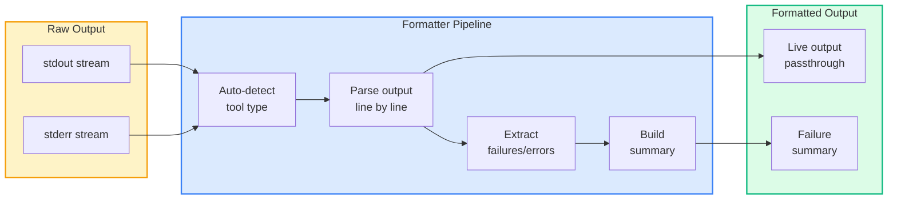
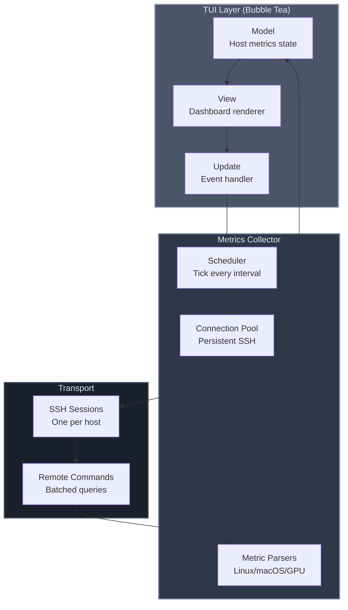
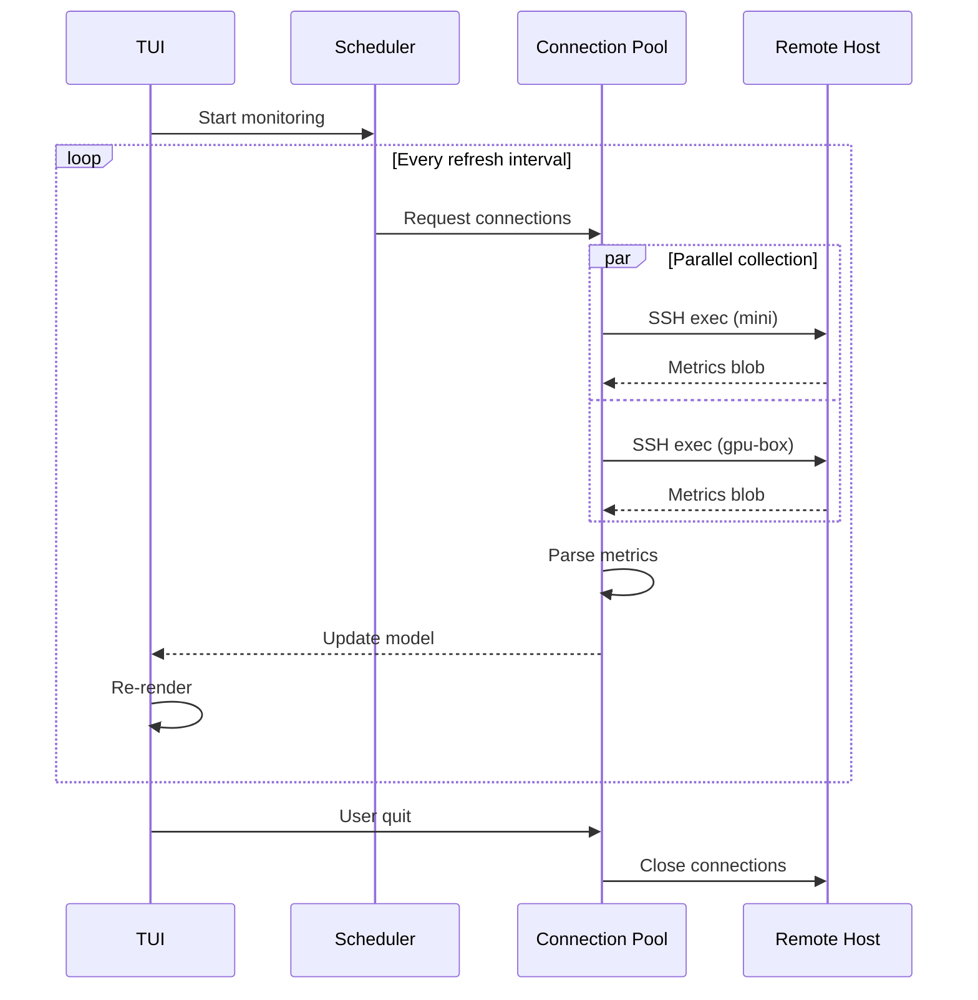

# Road Runner CLI: Architecture Plan

## TL;DR

**Road Runner** (`rr`) is a CLI tool that syncs local code to remote machines and executes commands, with smart host fallback (LAN → VPN → local), atomic locking, and beautiful output formatting. Built in **Go** for single-binary distribution, zero dependencies, and fast execution. The tool fills a gap between "just rsync && ssh" scripts and heavyweight tools like Ansible - targeting solo developers and small teams with shared build machines, home labs, or Mac Mini clusters.

---

## Problem Statement

### The Pain

Developers working with remote build machines face a fragmented workflow:

1. **Manual host management**: When working from different locations (home LAN vs. coffee shop via Tailscale), you need to remember which SSH alias works. Connection failures waste time.

2. **Repeated rsync incantations**: Complex exclude patterns, preserve rules, and delete flags are buried in shell history or scattered scripts.

3. **Concurrent access conflicts**: Two developers (or the same person in two terminals) running tests simultaneously on a shared machine causes corruption, race conditions, or misleading results.

4. **Lost output context**: When a remote test fails, you get a wall of text. Scrolling to find the actual failure is tedious. Copying paths back to your local editor requires mental translation.

5. **Tool overkill**: Ansible requires inventory files, YAML playbooks, and Python dependencies. Fabric requires Python and custom code. For "sync my code, run pytest," this is excessive.

### Who This Solves For

**Primary persona: Solo developer with a home lab**

- Has a Mac Mini or Linux box for running tests, ML training, or builds
- Works from multiple locations (home LAN, remote via Tailscale/WireGuard)
- Wants "it just works" without thinking about which host to use
- Values beautiful terminal output and fast iteration

**Secondary persona: Small team sharing a build server**

- 2-5 developers sharing a powerful machine for CI-like tasks
- Need to avoid stepping on each other's toes
- Don't want to set up a full CI system for internal dev workflows

**Non-goals (who this isn't for):**

- Large teams needing fleet management → use Ansible
- Container-native workflows → use DevPod or Tilt
- Continuous deployment → use proper CI/CD

### Why Now

The rise of Tailscale and similar mesh VPNs has made remote development practical without complex networking. Developers increasingly have "build boxes" that are sometimes local, sometimes remote. Existing tools don't handle this gracefully.

---

## Product Requirements

### Core Functionality

| Feature                   | Priority | Description                                              |
| ------------------------- | -------- | -------------------------------------------------------- |
| Smart host selection      | P0       | Try hosts in order (LAN → VPN → local fallback)          |
| File sync                 | P0       | rsync with configurable excludes and preserves           |
| Command execution         | P0       | Run arbitrary commands on selected host                  |
| Atomic locking            | P0       | Prevent concurrent runs with timeout and stale detection |
| Configuration file        | P0       | YAML config for hosts, sync rules, and tasks             |
| Streaming output          | P0       | Real-time stdout/stderr with proper TTY handling         |
| Exit code propagation     | P0       | Correct exit codes for scripting/CI integration          |
| SSH key setup helper      | P0       | Guided setup for SSH key authentication                  |
| Task definitions          | P1       | Named tasks with pre-configured commands                 |
| Output formatters         | P1       | Pluggable formatters (generic, pytest, jest, go test)    |
| Shell completions         | P1       | Bash, zsh, fish completions                              |
| Multi-host load balancing | P2       | Round-robin or least-recently-used across host pool      |
| Parallel task execution   | P2       | Run multiple tasks concurrently on different hosts       |

---

## Developer Experience Design

### Design Principles

1. **Zero to working in 60 seconds**: First successful run should happen within a minute of install
2. **Progressive disclosure**: Simple things simple, complex things possible
3. **Errors that teach**: Every error message explains what went wrong AND how to fix it
4. **Minimal surprise**: Behave like tools developers already know
5. **Quiet success, loud failure**: Don't spam on success; be helpful on failure

### Command Structure

After reviewing several naming approaches, here's the final CLI design:

```
rr <command> [options] [arguments]

Primary Commands:
  run <cmd>         Sync files and execute a command on remote
  exec <cmd>        Execute command without syncing (when you just ran sync)
  sync              Sync files only, no command execution
  <task>            Run a named task (if defined in config)

Setup & Status:
  init              Create starter config with guided prompts
  setup <host>      Configure SSH keys for a host
  status            Show connectivity and selected host
  monitor           Real-time dashboard of host metrics
  doctor            Diagnose common issues

Help:
  help [command]    Show help for a command
  version           Show version info
```

**Key design decisions:**

1. **Tasks are first-class citizens**: If you define a task called `test`, you run it with `rr test`, not `rr task test`. This matches `make`, `npm run`, and muscle memory.

2. **`run` vs `exec`**: `run` always syncs first (the common case). `exec` skips sync for when you're iterating quickly and just changed one file you already synced.

3. **`setup` is prominent**: New users will need this. It's not hidden under `rr config ssh-setup`.

4. **`doctor` for debugging**: When things don't work, `rr doctor` checks everything and reports issues.

### Command Naming Rationale

| Considered         | Chosen      | Why                                         |
| ------------------ | ----------- | ------------------------------------------- |
| `rr task test`     | `rr test`   | Shorter, matches make/npm patterns          |
| `rr run --no-sync` | `rr exec`   | Common enough to deserve its own command    |
| `rr hosts`         | `rr status` | Status shows hosts AND current selection    |
| `rr ssh-setup`     | `rr setup`  | More discoverable, allows future expansion  |
| `rr check`         | `rr doctor` | "Doctor" implies diagnosis and prescription |

### Reserved Command Names

These names cannot be used as task names (with helpful error if attempted):

```
run, exec, sync, init, setup, status, monitor, doctor, help, version, completion, update, host
```

If a user has a task named `run`, we error during config load:

```
Error: Task name 'run' conflicts with built-in command.
  Rename your task or use: rr run --task run
```

---

## Terminal Output States

### State Indicators

Every operation goes through clear phases with consistent visual language:

```
PHASE INDICATORS:
  ○  Pending (not started)
  ◐  In progress (animated spinner)
  ●  Complete (success)
  ✗  Failed
  ⊘  Skipped

COLORS:
  Blue     → In progress, informational
  Green    → Success
  Yellow   → Warning, skipped
  Red      → Error, failure
  Dim/Gray → Secondary info, timing
```

### Example: Successful Run

```bash
$ rr test

◐ Connecting...
● Connected to mini via mini-local                          0.1s

◐ Syncing 234 files...
● Synced                                                    1.2s

◐ Acquiring lock...
● Lock acquired                                             0.0s

━━━━━━━━━━━━━━━━━━━━━━━━━━━━━━━━━━━━━━━━━━━━━━━━━━━━━━━━━━━━━━━━

$ pytest -n auto
======================== test session starts =========================
...
======================== 47 passed in 3.21s ===========================

━━━━━━━━━━━━━━━━━━━━━━━━━━━━━━━━━━━━━━━━━━━━━━━━━━━━━━━━━━━━━━━━

● Done                                                      4.8s
```

### Example: Connection Fallback

```bash
$ rr test

◐ Connecting...
  ○ mini-local                                         timeout (2s)
  ● mini (tailscale)                                        0.3s
● Connected to mini via mini (tailscale)                    2.3s

◐ Syncing...
...
```

### Example: Failed Command with Pytest Formatter

```bash
$ rr test

● Connected to mini via mini-local                          0.1s
● Synced (47 files)                                         0.8s
● Lock acquired                                             0.0s

━━━━━━━━━━━━━━━━━━━━━━━━━━━━━━━━━━━━━━━━━━━━━━━━━━━━━━━━━━━━━━━━

$ pytest -n auto
...
FAILED tests/test_auth.py::test_login_expired - AssertionError
FAILED tests/test_users.py::test_duplicate - IntegrityError
...
======================== 2 failed, 45 passed in 3.21s =================

━━━━━━━━━━━━━━━━━━━━━━━━━━━━━━━━━━━━━━━━━━━━━━━━━━━━━━━━━━━━━━━━

✗ 2 tests failed                                            4.1s

  tests/test_auth.py:42
    test_login_expired
    AssertionError: Expected 401, got 200

  tests/test_users.py:108
    test_duplicate
    IntegrityError: duplicate key value violates unique constraint

```

### Example: Lock Contention

```bash
$ rr test

● Connected to mini via mini-local                          0.1s
● Synced (12 files changed)                                 0.3s

◐ Waiting for lock...
  Held by: alice@macbook since 2m ago

◐ Waiting for lock... (30s)
● Lock acquired                                            34.2s
...
```

### Example: SSH Setup

```bash
$ rr setup mini

Configuring SSH access for host: mini

◐ Checking for SSH keys...
● Found key: ~/.ssh/id_ed25519.pub

◐ Testing mini-local...
✗ mini-local: Permission denied (publickey)

  Your SSH key isn't authorized on this host.

? Copy your public key to mini-local? [Y/n] y

  Enter password for dev@192.168.1.50: ********

● Key copied to mini-local

◐ Testing mini-local...
● mini-local: Connected (12ms)

◐ Testing mini (fallback)...
● mini: Connected (45ms)

━━━━━━━━━━━━━━━━━━━━━━━━━━━━━━━━━━━━━━━━━━━━━━━━━━━━━━━━━━━━━━━━

✓ Host 'mini' is ready

  Both connection methods work:
    mini-local  192.168.1.50    12ms  (LAN)
    mini        100.64.0.5      45ms  (Tailscale)

  Added to config: .rr.yaml
```

### Example: Doctor Output

```bash
$ rr doctor

Road Runner Diagnostic Report

CONFIG
  ● Config file: .rr.yaml
  ● Schema valid
  ● 1 host configured, 2 tasks defined

SSH
  ● SSH key found: ~/.ssh/id_ed25519.pub
  ● SSH agent running with 2 keys loaded

HOSTS
  ● mini
    ● mini-local: Connected (11ms)
    ● mini: Connected (52ms)

DEPENDENCIES
  ● rsync 3.2.7 (local)
  ● rsync 3.2.3 (mini)

REMOTE
  ● Working directory exists: ~/projects/myapp
  ● Write permission: OK
  ● No stale locks found

━━━━━━━━━━━━━━━━━━━━━━━━━━━━━━━━━━━━━━━━━━━━━━━━━━━━━━━━━━━━━━━━

✓ Everything looks good
```

### Example: Doctor with Issues

```bash
$ rr doctor

Road Runner Diagnostic Report

CONFIG
  ● Config file: .rr.yaml
  ✗ Schema error at tasks.test.on_failure
    Invalid value "skip". Expected: continue, stop

    Fix: Change to one of the valid values

SSH
  ● SSH key found: ~/.ssh/id_ed25519.pub
  ✗ SSH agent not running

    Fix: eval $(ssh-agent) && ssh-add

HOSTS
  ✗ mini
    ✗ mini-local: Connection refused
    ● mini: Connected (52ms)

    mini-local may be offline or firewalled

━━━━━━━━━━━━━━━━━━━━━━━━━━━━━━━━━━━━━━━━━━━━━━━━━━━━━━━━━━━━━━━━

✗ 3 issues found

  Run with --fix to attempt automatic fixes where possible.
```

---

## Error Message Design

Every error follows this structure:

```
✗ <What failed>

  <Why it failed — technical details>

  <How to fix it — actionable steps>
```

### Error Examples

**Host unreachable:**

```
✗ Cannot connect to any configured hosts

  mini-local: Connection timed out after 2s
  mini: Connection refused

  Possible causes:
    • Host is offline or sleeping
    • Firewall blocking SSH (port 22)
    • Tailscale not connected

  Try:
    rr doctor          Check full diagnostic
    rr status          See host configuration
```

**Lock held:**

```
✗ Lock acquisition timed out after 5m

  Lock held by: alice@macbook
  Lock age: 12m (exceeds stale threshold of 10m)

  The lock appears stale. The holder may have crashed.

  To force release:
    rr run --force-unlock "your command"

  To wait longer:
    rr run --lock-timeout=15m "your command"
```

**Config error:**

```
✗ Invalid configuration in .rr.yaml

  Line 15: Unknown field 'host' in task definition

    14 │ tasks:
    15 │   test:
    16 │     host: mini          ← Did you mean 'hosts'?
    17 │     run: pytest

  Fix: Rename 'host' to 'hosts' (plural, takes a list)
```

**rsync not found:**

```
✗ rsync not found on remote host

  Host: mini (mini-local)
  PATH searched: /usr/bin:/usr/local/bin:/opt/homebrew/bin

  Install rsync on the remote:
    macOS:  brew install rsync
    Ubuntu: sudo apt install rsync
    Fedora: sudo dnf install rsync
```

---

## Configuration Schema

### File Location

`rr` uses two configuration files:

**Global config** (`~/.rr/config.yaml`):
- Contains host definitions (SSH connections, remote directories, tags, env vars)
- Personal settings not shared with team
- Created with `rr host add` or manually

**Project config** (`.rr.yaml`):
- Contains sync rules, tasks, output settings
- Shareable with team via version control
- Created with `rr init`

Project config is loaded from (first match wins):

1. `--config` flag
2. `.rr.yaml` in current directory
3. `.rr.yaml` in parent directories (stops at git root or home)

**Design decision**: Use `.rr.yaml` not `.road-runner.yaml`. It's shorter, matches the command name, and follows the pattern of `.npmrc`, `.nvmrc`, etc.

### Complete Schema

**Global config** (`~/.rr/config.yaml`):

```yaml
# ~/.rr/config.yaml
# Personal host definitions

version: 1

# ─────────────────────────────────────────────────────────────────────────────
# HOSTS
# Define remote machines and their connection methods
# ─────────────────────────────────────────────────────────────────────────────

hosts:
  # Host name (used in commands: rr run --host=mini)
  mini:
    # SSH connection strings, tried in order until one succeeds
    # Can be: hostname, user@hostname, or SSH config alias
    ssh:
      - mini-local # Try first (LAN, usually faster)
      - mini # Fallback (Tailscale/VPN)
      - dev@192.168.1.50 # Explicit user@host also works

    # Working directory on remote (where files sync to)
    # Supports variable expansion: ${PROJECT}, ${USER}
    dir: ~/projects/${PROJECT}

    # Optional tags for filtering (used with --tag flag)
    tags: [macos, arm64, fast]

  gpu-box:
    ssh:
      - gpu.local
      - gpu-tailscale
    dir: /home/dev/projects/${PROJECT}
    tags: [linux, gpu, cuda]

    # Optional: environment variables for this host
    env:
      CUDA_VISIBLE_DEVICES: "0,1"

# ─────────────────────────────────────────────────────────────────────────────
# DEFAULTS
# Personal default settings
# ─────────────────────────────────────────────────────────────────────────────

defaults:
  # Which host to use by default (if not specified)
  host: mini

  # Fall back to local execution if all remotes fail
  # Useful for CI environments or when traveling
  local_fallback: false

  # SSH probe timeout
  probe_timeout: 2s
```

**Project config** (`.rr.yaml`):

```yaml
# .rr.yaml
# Road Runner project configuration
# Docs: https://github.com/yourorg/rr#configuration

# Schema version (for future migrations)
version: 1

# ─────────────────────────────────────────────────────────────────────────────
# HOST REFERENCES
# Reference hosts defined in ~/.rr/config.yaml
# ─────────────────────────────────────────────────────────────────────────────

# List of hosts this project can use for load balancing
# If omitted, all global hosts are available
hosts:
  - mini
  - gpu-box

# Or use a single host (mutually exclusive with hosts:)
# host: mini

# ─────────────────────────────────────────────────────────────────────────────
# SYNC
# Configure file synchronization behavior
# ─────────────────────────────────────────────────────────────────────────────

sync:
  # Patterns to exclude from sync (not sent to remote)
  # Uses rsync pattern syntax
  exclude:
    - .git/
    - .venv/
    - __pycache__/
    - "*.pyc"
    - node_modules/
    - .mypy_cache/
    - .pytest_cache/
    - .ruff_cache/
    - .DS_Store
    - "*.log"

  # Patterns to preserve on remote (not deleted even if missing locally)
  # Useful for: virtual environments, downloaded data, build caches
  preserve:
    - .venv/
    - node_modules/
    - data/
    - .cache/

  # Extra rsync flags (optional)
  # Common additions: --compress, --info=progress2
  flags: []

# ─────────────────────────────────────────────────────────────────────────────
# LOCK
# Prevent concurrent executions on shared hosts
# ─────────────────────────────────────────────────────────────────────────────

lock:
  # Enable/disable locking (default: true)
  enabled: true

  # How long to wait for a lock before giving up
  timeout: 5m

  # Consider a lock stale after this duration (holder probably crashed)
  stale: 10m

# ─────────────────────────────────────────────────────────────────────────────
# TASKS
# Named command sequences (like Makefile targets)
# Run with: rr <taskname>
# ─────────────────────────────────────────────────────────────────────────────

tasks:
  # Simple task: single command
  build:
    run: make build

  # Task with description (shown in rr --help)
  test:
    description: Run all tests
    run: pytest -n auto

  # Task restricted to specific hosts
  train:
    description: Run ML training job
    hosts: [gpu-box] # Only runs on hosts with GPU
    run: python train.py
    env:
      WANDB_MODE: offline

  # Multi-step task
  ci:
    description: Full CI pipeline
    steps:
      - name: lint
        run: ruff check .

      - name: typecheck
        run: mypy .

      - name: test
        run: pytest -n auto
        on_fail: continue # Keep going even if tests fail

      - name: build
        run: make build

# ─────────────────────────────────────────────────────────────────────────────
# OUTPUT
# Configure terminal output formatting
# ─────────────────────────────────────────────────────────────────────────────

output:
  # Color mode: auto, always, never
  # "auto" disables color when output is piped
  color: auto

  # Output formatter for command output
  # auto: detect from command (pytest, jest, go test, etc.)
  # generic: simple pass-through with error highlighting
  # pytest, jest, go, cargo: tool-specific formatters
  format: auto

  # Show timing for each phase
  timing: true

  # Verbosity: quiet, normal, verbose
  verbosity: normal
```

### Schema Design Decisions

| Decision                   | Rationale                                        |
| -------------------------- | ------------------------------------------------ |
| `exclude` not `excludes`   | Matches rsync terminology, reads naturally       |
| `preserve` not `preserves` | Consistent with `exclude`                        |
| `dir` not `workdir`        | Shorter, still clear                             |
| `steps` not `commands`     | Implies ordered sequence, matches CI terminology |
| `on_fail` not `on_failure` | Shorter, common in CI configs                    |
| `stale` not `stale_after`  | Context makes it clear                           |

### Minimal Config

For the simplest case, you need at least one host in your global config:

```yaml
# ~/.rr/config.yaml
hosts:
  mini:
    ssh: [mini-local, mini]
    dir: ~/projects/${PROJECT}
```

A project config (`.rr.yaml`) is optional. Everything else has sensible defaults. This enables:

```bash
rr run "pytest"
rr run "make build"
```

### Zero-Config Mode

If no global hosts are configured and user runs `rr run`, we offer to create one:

```bash
$ rr run "pytest"

No configuration found. Let's set one up.

? SSH host or alias to use: mini-local
? Add a fallback host? (e.g., Tailscale): mini

Testing connections...
  ● mini-local: Connected (12ms)
  ● mini: Connected (48ms)

Created .rr.yaml with host 'mini'

Proceeding with: rr run "pytest"
...
```

---

## Technical Architecture

### Language Choice: Go

**Decision**: Build in Go, not TypeScript or Python.

**Rationale:**

| Factor                     | Go                         | TypeScript                | Python                  |
| -------------------------- | -------------------------- | ------------------------- | ----------------------- |
| Single binary distribution | ✅ Yes                     | ❌ Needs Node.js          | ❌ Needs Python         |
| Cross-compilation          | ✅ Trivial                 | ⚠️ Possible but complex   | ❌ Difficult            |
| Startup time               | ✅ ~10ms                   | ❌ ~200-500ms             | ❌ ~100-300ms           |
| SSH libraries              | ✅ golang.org/x/crypto/ssh | ⚠️ ssh2 (native bindings) | ✅ Paramiko             |
| CLI frameworks             | ✅ Cobra (excellent)       | ✅ Commander/yargs        | ✅ Click/Typer          |
| Concurrency                | ✅ Goroutines              | ⚠️ Event loop limits      | ⚠️ Threading is awkward |

The killer feature is **single binary distribution**. Users run `brew install rr` or download a binary—no runtime dependencies. This matches the "just works" philosophy.

Go's SSH library means we don't shell out to `ssh`, giving us better error handling, connection pooling, and cross-platform consistency.

### System Architecture



### Component Responsibilities

**CLI Layer**

- Parse commands and flags using Cobra
- Load and merge configuration (file → env → flags) using Viper
- Generate shell completions for task names
- Validate inputs before passing to core

**Core Engine**

- **Host Selector**: Probe hosts in order, cache connectivity results, handle fallback
- **Sync Engine**: Build rsync command with configured excludes/preserves, show progress
- **Command Executor**: Execute commands via SSH or locally, handle streaming output
- **Lock Manager**: Acquire/release locks on remote, detect stale locks, handle timeout

**Output Layer**

- **Stream Handler**: Multiplex stdout/stderr, handle ANSI codes, buffer lines
- **Formatters**: Parse output for known tools (pytest, jest), extract failures
- **TUI Components**: Progress indicators, spinners, colored output using Bubble Tea

**Transport Layer**

- **SSH Client**: Connection pooling, keep-alive, exec/shell modes
- **Local Executor**: os/exec wrapper for local fallback

**Setup & Diagnostics**

- **SSH Key Manager**: Check for keys, generate if needed, run ssh-copy-id
- **Doctor Checks**: Validate config, test connectivity, check dependencies

### Package Dependencies

This diagram shows the simplified package dependency graph with key relationships:



**Key dependencies:**
- `cmd/rr` is the entry point, calls `internal/cli`
- `cli` orchestrates `host`, `sync`, `lock`, `exec`, and `config`
- `host` uses `pkg/sshutil` for SSH operations
- `sync` and `lock` both depend on `host` for connection management

### The `rr run` Command Flow

This sequence diagram shows what happens when you run `rr run "make test"`:

```mermaid
sequenceDiagram
    participant User
    participant CLI as cli/run.go
    participant Config as config
    participant Host as host/selector
    participant Sync as sync
    participant Lock as lock
    participant Exec as exec

    User->>CLI: rr run "make test"

    rect rgb(30, 58, 138)
        Note over CLI,Config: Phase 1: Load Config
        CLI->>Config: Find() + Load()
        Config-->>CLI: config
    end

    rect rgb(20, 83, 45)
        Note over CLI,Host: Phase 2: Select Host + Connect
        CLI->>Host: Select(preferredHost)
        loop Try each SSH alias
            Host->>Host: ProbeAndConnect(alias)
            alt Success
                Note over Host: Return connection
            else Failure
                Note over Host: Try next alias
            end
        end
        Host-->>CLI: Connection
    end

    rect rgb(120, 53, 15)
        Note over CLI,Sync: Phase 3: Sync Files
        CLI->>Sync: Sync(conn, workDir, excludes)
        Sync-->>CLI: files synced
    end

    rect rgb(88, 28, 135)
        Note over CLI,Lock: Phase 4: Acquire Lock
        CLI->>Lock: Acquire(conn, projectHash)
        alt Lock acquired
            Lock-->>CLI: Lock handle
        else Lock held by other
            Lock->>Lock: Wait and retry
        end
    end

    rect rgb(131, 24, 67)
        Note over CLI,Exec: Phase 5: Execute Command
        CLI->>Exec: ExecStream(command)
        Exec-->>User: streaming output
        Exec-->>CLI: exit code
    end

    CLI->>Lock: Release()
    CLI->>User: exit code + summary
```



**Phase summary:**
1. **Load Config** - Find and parse `.rr.yaml`
2. **Select Host** - Probe SSH aliases in order, connect to first available
3. **Sync Files** - rsync local files to remote working directory
4. **Acquire Lock** - Prevent concurrent execution on shared hosts
5. **Execute** - Run command, stream output, capture exit code
6. **Cleanup** - Release lock, return result

### Host Selection Flow

The host selector implements a probe-and-select pattern with ordered fallback:



**Selection logic:**
1. Load configured SSH aliases for the host (e.g., `[mini-local, mini-tailscale]`)
2. Probe each alias in order with a 2-second timeout
3. Return first successful connection and cache it
4. If all fail and `local_fallback: true`, execute locally
5. Otherwise, return error with diagnostic info

### Lock Management

Locking prevents concurrent runs on shared remotes. The lock is a directory on the remote host (atomic mkdir) containing metadata about the lock holder.



**Lock file structure:**

```
/tmp/rr-<project-hash>.lock/
├── info.json    # {"user": "alice", "host": "macbook", "started": "..."}
└── pid          # PID on remote (for potential kill)
```

### SSH Key Setup Flow



**Security decisions:**

1. **No passwords in config**: SSH keys only. This is a security requirement, not a convenience tradeoff.

2. **ssh-copy-id for key copying**: We shell out to ssh-copy-id rather than reimplementing. It handles edge cases (authorized_keys permissions, creating .ssh directory) correctly.

3. **Key generation**: Prefer ed25519, fall back to rsa if ed25519 unavailable (old systems).

---

## Framework and Library Selection

| Component           | Library                                                                                                           | Rationale                                            |
| ------------------- | ----------------------------------------------------------------------------------------------------------------- | ---------------------------------------------------- |
| CLI framework       | [Cobra](https://github.com/spf13/cobra)                                                                           | Industry standard, great docs, built-in completions  |
| Config management   | [Viper](https://github.com/spf13/viper)                                                                           | Pairs with Cobra, handles file + env + flags merging |
| SSH                 | [golang.org/x/crypto/ssh](https://pkg.go.dev/golang.org/x/crypto/ssh)                                             | Official Go SSH implementation                       |
| SSH config parsing  | [kevinburke/ssh_config](https://github.com/kevinburke/ssh_config)                                                 | Parse ~/.ssh/config for user settings                |
| TUI/Styling         | [Bubble Tea](https://github.com/charmbracelet/bubbletea) + [Lip Gloss](https://github.com/charmbracelet/lipgloss) | Modern, handles terminal edge cases                  |
| Interactive prompts | [Huh](https://github.com/charmbracelet/huh)                                                                       | Part of Charm ecosystem, for setup wizard            |
| YAML                | [gopkg.in/yaml.v3](https://pkg.go.dev/gopkg.in/yaml.v3)                                                           | Standard Go YAML library                             |
| Schema validation   | [gojsonschema](https://github.com/xeipuuv/gojsonschema)                                                           | Validate config with helpful errors                  |
| Testing             | [testify](https://github.com/stretchr/testify)                                                                    | Assertions and mocking                               |

---

## Project Structure

```
rr/
├── cmd/
│   └── rr/
│       └── main.go              # Entry point
├── internal/
│   ├── cli/                     # Cobra command definitions
│   │   ├── root.go
│   │   ├── run.go
│   │   ├── exec.go
│   │   ├── sync.go
│   │   ├── setup.go
│   │   ├── status.go
│   │   ├── monitor.go
│   │   ├── doctor.go
│   │   └── init.go
│   ├── config/                  # Configuration loading
│   │   ├── config.go
│   │   ├── schema.go
│   │   ├── validate.go
│   │   └── expand.go            # Variable expansion
│   ├── host/                    # Host selection
│   │   ├── selector.go
│   │   └── probe.go
│   ├── sync/                    # rsync wrapper
│   │   ├── sync.go
│   │   └── progress.go
│   ├── exec/                    # Command execution
│   │   ├── executor.go
│   │   ├── ssh.go
│   │   └── local.go
│   ├── lock/                    # Lock management
│   │   └── lock.go
│   ├── setup/                   # SSH key setup
│   │   ├── keys.go
│   │   └── copy.go
│   ├── doctor/                  # Diagnostics
│   │   └── checks.go
│   ├── monitor/                 # Host monitoring dashboard
│   │   ├── monitor.go           # Main TUI program
│   │   ├── metrics.go           # Metric collection
│   │   ├── collector.go         # Parallel SSH fetcher
│   │   └── parsers/
│   │       ├── linux.go
│   │       ├── darwin.go
│   │       └── gpu.go
│   ├── output/                  # Output formatting
│   │   ├── stream.go
│   │   ├── formatter.go
│   │   ├── state.go             # Progress state management
│   │   └── formatters/
│   │       ├── generic.go
│   │       ├── pytest.go
│   │       ├── jest.go
│   │       └── gotest.go
│   └── ui/                      # TUI components
│       ├── spinner.go
│       ├── progress.go
│       └── prompt.go
├── pkg/                         # Potentially reusable packages
│   └── sshutil/
├── configs/
│   └── schema.json              # JSON Schema for validation
├── completions/                 # Generated shell completions
├── docs/
│   ├── configuration.md
│   ├── formatters.md
│   └── troubleshooting.md
├── .goreleaser.yaml
├── go.mod
└── README.md
```

---

## Output Formatter Architecture

Formatters transform raw command output into structured, readable summaries.



### Formatter Interface

```go
type Formatter interface {
    // Name returns the formatter identifier
    Name() string

    // Detect returns confidence (0-100) this formatter handles the output
    Detect(command string, initialOutput []byte) int

    // ProcessLine handles a single line of output
    ProcessLine(line string) (display string, data *LineData)

    // Summary generates the final summary after command completes
    Summary(exitCode int) *Summary
}

type LineData struct {
    Type     LineType  // Normal, Error, Failure, Pass, Skip
    TestName string
    FilePath string
    Line     int
    Message  string
}

type Summary struct {
    Passed   int
    Failed   int
    Skipped  int
    Failures []Failure
}
```

### Auto-Detection Logic

```go
func DetectFormatter(command string, output []byte) Formatter {
    // Check command first
    if strings.Contains(command, "pytest") {
        return &PytestFormatter{}
    }
    if strings.Contains(command, "jest") || strings.Contains(command, "vitest") {
        return &JestFormatter{}
    }
    if strings.Contains(command, "go test") {
        return &GoTestFormatter{}
    }

    // Fall back to output detection
    for _, f := range formatters {
        if f.Detect("", output) > 50 {
            return f
        }
    }

    return &GenericFormatter{}
}
```

---

## Distribution Strategy

### Release Artifacts

Each release produces:

- `rr-darwin-amd64` (macOS Intel)
- `rr-darwin-arm64` (macOS Apple Silicon)
- `rr-linux-amd64`
- `rr-linux-arm64`
- `rr-windows-amd64.exe`
- SHA256 checksums
- Homebrew formula
- Shell completions (bash, zsh, fish)

### Installation Methods

```bash
# Homebrew (macOS/Linux) - recommended
brew install yourorg/tap/rr

# Go install
go install github.com/yourorg/rr@latest

# Direct download
curl -sSL https://get.rr.dev | sh

# Manual
curl -LO https://github.com/yourorg/rr/releases/latest/download/rr-$(uname -s)-$(uname -m)
chmod +x rr-* && sudo mv rr-* /usr/local/bin/rr
```

### Shell Completions

Generated automatically and included in releases:

```bash
# After install, add to shell config:
# Bash
echo 'eval "$(rr completion bash)"' >> ~/.bashrc

# Zsh
echo 'eval "$(rr completion zsh)"' >> ~/.zshrc

# Fish
rr completion fish > ~/.config/fish/completions/rr.fish
```

Completions include:

- All commands and subcommands
- Task names from current directory's config
- Host names from config
- Flag values where applicable

---

## Success Metrics

### Adoption Metrics

| Metric            | Target (6 months)          | Measurement                |
| ----------------- | -------------------------- | -------------------------- |
| GitHub stars      | 500+                       | GitHub API                 |
| Weekly downloads  | 200+                       | GitHub releases + Homebrew |
| Active issues/PRs | >10 open, <1 week response | GitHub                     |

### Quality Metrics

| Metric            | Target                     | Measurement     |
| ----------------- | -------------------------- | --------------- |
| Test coverage     | >80%                       | Go coverage     |
| Time to first run | <60 seconds                | User testing    |
| Connection probe  | <500ms for reachable hosts | Instrumentation |
| Sync performance  | Within 10% of raw rsync    | Benchmarks      |

### User Experience Metrics

| Metric                  | Target                  | Measurement     |
| ----------------------- | ----------------------- | --------------- |
| Config creation         | <2 minutes              | User testing    |
| Setup wizard completion | >90% success rate       | Analytics       |
| Error self-resolution   | >80% via error messages | Support tickets |

---

## Host Monitoring (btop-style Dashboard)

### Overview

The `rr monitor` command opens a real-time terminal dashboard showing system metrics across all configured hosts. Think btop/htop, but for your fleet of worker machines. This gives you instant visibility into which hosts are idle, which are under load, and where to send your next job.

### Why This Matters

When you have multiple remote machines (home lab, shared build servers, GPU boxes), choosing where to run a job isn't always obvious:

- Is the GPU box already running someone's training job?
- Which machine has RAM headroom for a memory-hungry test suite?
- Is network throughput bottlenecked on the VPN connection?

Currently you'd SSH into each machine and run htop manually. `rr monitor` surfaces this info in one view.

### Command Interface

```
rr monitor [flags]

FLAGS
      --hosts string      Filter to specific hosts (comma-separated)
      --interval string   Refresh interval (default: 1s)
```

**Examples:**

```bash
# Monitor all configured hosts
rr monitor

# Monitor specific hosts
rr monitor --hosts=mini,gpu-box

# Faster refresh for real-time watching
rr monitor --interval=500ms

# Skip GPU detection (useful if nvidia-smi hangs)
rr monitor --no-gpu
```

### Visual Design Philosophy

**Design direction: Precision & Density** with elements of **Data & Analysis**. This is a power-user tool for developers who live in their terminals. Think Linear meets btop: information-dense, technically sophisticated, zero decoration for decoration's sake.

**Personality:**
- Cool tones (slate, blue-gray) for the technical/trustworthy feel
- Monospace everything (data-forward)
- Borders over shadows (flat but structured)
- Color only for meaning (status, thresholds, alerts)
- Generous use of Unicode box-drawing and Braille characters for graphs

### Color Palette

```
Background:     #0d1117 (deep navy-black)
Surface:        #161b22 (elevated panels)
Border:         #30363d (subtle structure)
Border-focus:   #58a6ff (blue accent when selected)

Text:
  Primary:      #e6edf3 (high contrast)
  Secondary:    #8b949e (labels, metadata)
  Muted:        #484f58 (disabled, dividers)

Semantic:
  Healthy:      #3fb950 (green - under threshold)
  Warning:      #d29922 (amber - approaching limit)
  Critical:     #f85149 (red - over threshold)
  Accent:       #58a6ff (blue - interactive, selected)

Graph fills:
  CPU:          #a371f7 (purple gradient low→high)
  RAM:          #58a6ff (blue)
  GPU:          #3fb950 (green)
  Network:      #8b949e (gray, secondary)
```

### Dashboard Layout: Default View

Full-width, information-dense layout optimized for wide terminals (120+ cols):

```
╭──────────────────────────────────────────────────────────────────────────────────────────────────────────╮
│  rr monitor                                                           3 hosts │ ● 3 online │ ↻ 2s ago  │
├──────────────────────────────────────────────────────────────────────────────────────────────────────────┤
│                                                                                                          │
│  ╭─ mini ─────────────────────────────────────────────────────────────────────────────────────────────╮  │
│  │ ● mini-local (12ms)                                                          macOS arm64 │ M2 Pro │  │
│  │                                                                                                    │  │
│  │   CPU ▁▂▃▅▆▇▆▅▄▃▂▂▃▄▅▆▇█▇▆▅▄▃▂▁▁▂▃▄▅▆▆▅▄▃▂▁▁▂▃▄▅   78%  ██████████████████░░░░░░  8/8 cores      │  │
│  │   RAM ▄▄▄▄▄▄▄▄▄▄▄▅▅▅▅▅▅▅▅▅▅▅▅▅▅▅▅▅▅▅▅▅▅▅▅▅▅▅▅▅▅   39%  █████████░░░░░░░░░░░░░░░  6.2/16 GB      │  │
│  │   NET ▁▁▁▂▃▅▇▇▅▃▂▁▁▂▃▅▇█▇▅▃▂▁▁▁▁▁▂▃▅▇▇▅▃▂▁▁▁▁▁▁   ↓ 12 MB/s  ↑ 2.4 MB/s                         │  │
│  │                                                                                                    │  │
│  │   load  4.21  4.08  3.92      uptime  12d 4h 22m      processes  412                              │  │
│  ╰────────────────────────────────────────────────────────────────────────────────────────────────────╯  │
│                                                                                                          │
│  ╭─ gpu-box ──────────────────────────────────────────────────────────────────────────────────────────╮  │
│  │ ● tailscale (48ms)                                                      Linux x86_64 │ RTX 4090  │  │
│  │                                                                                                    │  │
│  │   CPU ▁▁▁▁▁▁▁▁▁▁▂▂▂▂▂▂▂▁▁▁▁▁▁▁▁▁▁▁▁▂▂▂▂▂▁▁▁▁▁▁▁   18%  ████░░░░░░░░░░░░░░░░░░░░  2/32 cores     │  │
│  │   RAM ▃▃▃▃▃▃▃▃▃▃▃▃▃▃▃▃▃▃▃▃▃▃▃▃▃▃▃▃▃▃▃▃▃▃▃▃▃▃▃▃▃   25%  ██████░░░░░░░░░░░░░░░░░░  32/128 GB      │  │
│  │   GPU ▇▇▇▇▇▇▇▇██████████████▇▇▇▇▇▇▇▇▇▇▇▇▇▇▇▇▇▇▇   82%  ████████████████████░░░░  20/24 GB VRAM  │  │
│  │   NET ▅▅▅▅▅▅▅▅▅▅▅▅▅▅▅▅▅▅▅▅▅▅▅▅▅▅▅▅▅▅▅▅▅▅▅▅▅▅▅▅▅   ↓ 45 MB/s  ↑ 1.2 MB/s                         │  │
│  │                                                                                                    │  │
│  │   load  0.82  0.91  0.87      uptime  3d 14h 8m       gpu-temp  72°C  gpu-power  285W            │  │
│  ╰────────────────────────────────────────────────────────────────────────────────────────────────────╯  │
│                                                                                                          │
│  ╭─ build-srv ────────────────────────────────────────────────────────────────────────────────────────╮  │
│  │ ○ unreachable                                                         last seen 2h ago │ Linux   │  │
│  │                                                                                                    │  │
│  │   CPU ░░░░░░░░░░░░░░░░░░░░░░░░░░░░░░░░░░░░░░░░░    -   ░░░░░░░░░░░░░░░░░░░░░░░░  -/16 cores      │  │
│  │   RAM ░░░░░░░░░░░░░░░░░░░░░░░░░░░░░░░░░░░░░░░░░    -   ░░░░░░░░░░░░░░░░░░░░░░░░  -/64 GB         │  │
│  │   GPU ░░░░░░░░░░░░░░░░░░░░░░░░░░░░░░░░░░░░░░░░░    -   ░░░░░░░░░░░░░░░░░░░░░░░░  -/- VRAM        │  │
│  │   NET ░░░░░░░░░░░░░░░░░░░░░░░░░░░░░░░░░░░░░░░░░    -              -                              │  │
│  │                                                                                                    │  │
│  │   Reconnecting in 28s...                                                                          │  │
│  ╰────────────────────────────────────────────────────────────────────────────────────────────────────╯  │
│                                                                                                          │
├──────────────────────────────────────────────────────────────────────────────────────────────────────────┤
│  q quit   s sort   / filter   ↑↓ select   Enter ssh   Tab expand   ? help                                │
╰──────────────────────────────────────────────────────────────────────────────────────────────────────────╯
```

### Dashboard Layout: Compact View

For narrower terminals (80-120 cols), collapse to essential metrics:

```
╭────────────────────────────────────────────────────────────────────────────────╮
│  rr monitor                                      3 hosts │ ● 3 online │ ↻ 2s  │
├────────────────────────────────────────────────────────────────────────────────┤
│                                                                                │
│  ● mini         CPU ██████████████░░░░░░  78%   RAM █████████░░░░░░░░░  39%   │
│    mini-local   ▁▂▃▅▆▇▆▅▄▃▂▂▃▄▅▆▇█▇▆▅   8/8    ▄▄▄▄▄▄▄▄▄▄▄▅▅▅▅▅▅▅▅  6/16G   │
│                                                                                │
│  ● gpu-box      CPU ████░░░░░░░░░░░░░░░░  18%   RAM ██████░░░░░░░░░░░░  25%   │
│    tailscale    ▁▁▁▁▁▁▁▁▁▁▂▂▂▂▂▂▂▁▁▁▁   2/32   ▃▃▃▃▃▃▃▃▃▃▃▃▃▃▃▃▃▃▃  32/128G  │
│                 GPU ████████████████████  82%   20/24 GB  72°C                 │
│                                                                                │
│  ○ build-srv    CPU ░░░░░░░░░░░░░░░░░░░░   -    RAM ░░░░░░░░░░░░░░░░░░░   -    │
│    unreachable  last seen 2h ago                                               │
│                                                                                │
├────────────────────────────────────────────────────────────────────────────────┤
│  q quit   s sort   ↑↓ select   Enter ssh   ? help                              │
╰────────────────────────────────────────────────────────────────────────────────╯
```

### Dashboard Layout: Expanded Host Detail

Press `Tab` or `Enter` on a host to expand into a detailed single-host view:

```
╭──────────────────────────────────────────────────────────────────────────────────────────────────────────╮
│  rr monitor › gpu-box                                              ● online │ tailscale (48ms) │ ↻ 1s  │
├──────────────────────────────────────────────────────────────────────────────────────────────────────────┤
│                                                                                                          │
│   ╭─ CPU ─────────────────────────────────────────────────────────────────────────────────────────────╮  │
│   │                                                                                                   │  │
│   │   100% ┤                                                                                          │  │
│   │        │              ╭─╮                                        ╭╮                               │  │
│   │    75% ┤    ╭────╮   ╭╯ ╰╮          ╭────╮              ╭──╮    ╭╯│                               │  │
│   │        │   ╭╯    ╰╮ ╭╯   ╰╮        ╭╯    ╰╮   ╭────╮  ╭╯  ╰╮  ╭╯ │                               │  │
│   │    50% ┤ ╭─╯      ╰─╯     ╰──────╮╭╯      ╰╮ ╭╯    ╰╮╭╯    ╰──╯  │╭────────╮                     │  │
│   │        │╭╯                       ╰╯        ╰─╯      ╰╯           ╰╯        ╰─────                 │  │
│   │    25% ┤│                                                                                         │  │
│   │        ││                                                                                         │  │
│   │     0% ┼┴────────────────────────────────────────────────────────────────────────────────────────│  │
│   │         -60s                        -30s                          now                             │  │
│   │                                                                                                   │  │
│   │   Current: 18%      Avg (1m): 22%      Peak (1m): 78%      Cores: 32 x86_64                      │  │
│   ╰───────────────────────────────────────────────────────────────────────────────────────────────────╯  │
│                                                                                                          │
│   ╭─ Memory ───────────────────────────────────╮  ╭─ GPU: RTX 4090 ─────────────────────────────────╮  │
│   │                                            │  │                                                  │  │
│   │   RAM     ██████░░░░░░░░░░░░░░  32/128 GB  │  │   Compute  ████████████████████░░░░  82%        │  │
│   │   Swap    ░░░░░░░░░░░░░░░░░░░░   0/8 GB    │  │   VRAM     █████████████████░░░░░░░  20/24 GB   │  │
│   │   Cached  ███████████░░░░░░░░░  48 GB      │  │   Temp     ████████████████░░░░░░░░  72°C       │  │
│   │                                            │  │   Power    █████████████████████░░░  285/350W   │  │
│   │   Used: 32 GB  Buffers: 2.1 GB             │  │                                                  │  │
│   │   Available: 94 GB                         │  │   Driver: 545.29.06  CUDA: 12.3                 │  │
│   ╰────────────────────────────────────────────╯  ╰──────────────────────────────────────────────────╯  │
│                                                                                                          │
│   ╭─ Network ─────────────────────────────────────────────────────────────────────────────────────────╮  │
│   │   eth0       ↓ 45.2 MB/s ▅▆▇▇█▇▆▅▄▃▂▂▃▄▅▆▇█▇▆▅▄    ↑ 1.2 MB/s ▁▁▁▂▂▂▂▁▁▁▁▁▁▂▂▂▂▁▁▁▁            │  │
│   │   tailscale  ↓ 102 KB/s ▁▁▁▁▁▁▁▁▁▁▁▁▁▁▁▁▁▁▁▁▁▁▁    ↑ 48 KB/s  ▁▁▁▁▁▁▁▁▁▁▁▁▁▁▁▁▁▁▁▁▁            │  │
│   ╰───────────────────────────────────────────────────────────────────────────────────────────────────╯  │
│                                                                                                          │
│   ╭─ System ──────────────────────────────────────────────────────────────────────────────────────────╮  │
│   │   Load: 0.82, 0.91, 0.87    Uptime: 3d 14h 8m    Processes: 847    Users: 2                      │  │
│   │   OS: Ubuntu 22.04 LTS      Kernel: 6.5.0-44-generic                                             │  │
│   ╰───────────────────────────────────────────────────────────────────────────────────────────────────╯  │
│                                                                                                          │
├──────────────────────────────────────────────────────────────────────────────────────────────────────────┤
│  Esc back   p processes   l logs   t run task   c connect   ? help                                       │
╰──────────────────────────────────────────────────────────────────────────────────────────────────────────╯
```

### Visual Elements

**Progress Bars:**
Use block characters for smooth gradients. The bar fills left-to-right with color based on threshold:

```
0-60%:   Green   ████████████░░░░░░░░░░░░
60-80%:  Amber   ██████████████████░░░░░░
80-100%: Red     ██████████████████████░░
```

**Sparklines:**
Use Braille characters (U+2800-U+28FF) for high-resolution mini-graphs. Each character encodes 2x4 dots, giving smooth curves in minimal space:

```
▁▂▃▄▅▆▇█  - Block elements (8 levels)
⣀⣤⣶⣿     - Braille (finer resolution)
```

For the 60-second history graphs, sample every 1s, display last 40 points in ~20 character width using Braille combining.

**Box Drawing:**
Use rounded corners (`╭╮╯╰`) for the modern aesthetic. Single-line borders throughout for clean hierarchy.

```
╭──────╮  Rounded corners
│      │  Single-line sides
╰──────╯
```

**State Indicators:**
```
●  Connected (green)     Filled circle
◐  Connecting (blue)     Half-filled, animated rotation
○  Disconnected (red)    Empty circle
◌  Unknown (gray)        Dotted circle
```

### Typography Hierarchy

All text is monospace. Hierarchy through weight and color only:

| Element | Style | Color |
|---------|-------|-------|
| Section headers | CAPS | Secondary (#8b949e) |
| Host names | Bold | Primary (#e6edf3) |
| Metrics labels | Normal | Secondary (#8b949e) |
| Metric values | Bold, tabular | Primary (#e6edf3) |
| Status text | Normal | Semantic (green/amber/red) |
| Help text | Dim | Muted (#484f58) |

### Animation & Motion

**Subtle, purposeful animations only:**

1. **Spinner for connecting hosts**: 4-frame rotation at 150ms (`◐ ◓ ◑ ◒`)
2. **Metric update pulse**: Brief highlight flash (100ms) when value changes significantly
3. **Graph scroll**: Smooth left-shift animation as new data arrives
4. **Panel transitions**: 150ms ease-out when expanding/collapsing views

**No spring physics, no bouncing, no decorative motion.**

### Responsive Behavior

The UI adapts to terminal width:

| Width | Layout |
|-------|--------|
| <80 cols | Single column, metrics only (no graphs) |
| 80-120 cols | Compact view (graphs inline, abbreviated labels) |
| 120+ cols | Full view (expanded cards, detailed graphs) |
| 160+ cols | Side-by-side host cards (2 columns) |

Height adapts similarly:
- <24 rows: Header + metrics only, no footer help
- 24-40 rows: Standard layout
- 40+ rows: Taller graphs, more history visible

### Threshold Configuration

Visual thresholds are configurable per metric:

```yaml
monitor:
  thresholds:
    cpu:
      warning: 70    # Amber above 70%
      critical: 90   # Red above 90%
    ram:
      warning: 80
      critical: 95
    gpu:
      warning: 85
      critical: 95
    gpu_temp:
      warning: 75    # Celsius
      critical: 85
```

### Accessibility

- All colors meet WCAG AA contrast on dark background
- State never communicated by color alone (icons + color)
- Keyboard-only navigation (no mouse required)
- Screen reader: Alt text via ARIA-like descriptions in help overlay

### Metrics Collected

| Metric | Source Command | Fallback |
|--------|----------------|----------|
| CPU % | `/proc/stat` or `top -l 1` (macOS) | `uptime` load average |
| CPU cores | `nproc` or `sysctl hw.ncpu` | Parse `/proc/cpuinfo` |
| RAM used/total | `free -b` or `vm_stat` (macOS) | Parse `/proc/meminfo` |
| GPU % | `nvidia-smi --query-gpu=...` | Skip if unavailable |
| GPU memory | `nvidia-smi --query-gpu=...` | Skip if unavailable |
| Network throughput | `/proc/net/dev` delta or `netstat -ib` | `ifstat` if available |

**GPU support:**
- NVIDIA: `nvidia-smi` (most common)
- AMD: `rocm-smi` (if available)
- Apple Silicon: `powermetrics` (requires sudo, so optional)
- Intel: Skip (not typically used for compute)

### Architecture



### Data Collection Strategy

**Challenge:** Running multiple SSH commands per host per refresh is slow and creates overhead.

**Solution:** Batch metrics collection into a single SSH exec per refresh:

```bash
# Single command that outputs all metrics as JSON
cat /proc/stat /proc/meminfo /proc/net/dev 2>/dev/null; \
nvidia-smi --query-gpu=utilization.gpu,memory.used,memory.total --format=csv,noheader 2>/dev/null || true
```

The parser handles the combined output and extracts metrics. This keeps SSH round-trips to one per host per interval.

**Connection pooling:** Keep SSH connections open between refreshes. Reconnect on failure with exponential backoff.

### Metric Collection Flow



### Host State Indicators

| State | Display | Meaning |
|-------|---------|---------|
| Connected | Green hostname | Metrics flowing |
| Slow | Yellow hostname | Response >1s |
| Unreachable | Red hostname + "(unreachable)" | Connection failed |
| Reconnecting | Dim hostname + spinner | Attempting reconnect |

### Keyboard Controls

| Key | Action |
|-----|--------|
| `q` / `Ctrl+C` | Quit |
| `r` | Force refresh now |
| `s` | Cycle sort order (name, CPU, RAM, GPU) |
| `↑` / `↓` | Select host (for future drill-down) |
| `Enter` | SSH into selected host (opens new terminal) |
| `?` | Toggle help overlay |

### Configuration

Add to `.rr.yaml`:

```yaml
monitor:
  # Default refresh interval
  interval: 2s

  # Metrics to collect (all enabled by default)
  metrics:
    cpu: true
    ram: true
    gpu: true      # Set false to skip GPU detection entirely
    network: true

  # Hosts to exclude from monitoring (still usable for run/sync)
  exclude: []

  # GPU detection timeout (nvidia-smi can hang on misconfigured systems)
  gpu_timeout: 5s
```

### Error Handling

**Host unreachable:**
- Show last known metrics (if any) with timestamp
- Gray out the row
- Continue monitoring other hosts
- Retry connection every 30s in background

**Command timeout:**
- Use cached value from previous refresh
- Mark metric as stale (dim color)
- Don't block other metrics

**GPU detection failure:**
- Log once, then skip GPU for that host
- Don't retry every refresh (it's slow)

### Platform Support

| Platform | CPU | RAM | GPU | Network |
|----------|-----|-----|-----|---------|
| Linux | Full | Full | NVIDIA, AMD | Full |
| macOS | Full | Full | Apple (limited) | Full |
| Windows (WSL) | Full | Full | NVIDIA | Partial |
| FreeBSD | Partial | Full | No | Partial |

### Implementation Notes

**TUI framework:** [Bubble Tea](https://github.com/charmbracelet/bubbletea) for the reactive model, [Lip Gloss](https://github.com/charmbracelet/lipgloss) for styling. The monitor is a full-screen Bubble Tea program that takes over the terminal.

**Sparkline rendering:** Use [asciigraph](https://github.com/guptarohit/asciigraph) or custom Braille rendering for high-resolution mini-graphs. Keep last 60 data points per metric in memory.

**Responsive layout:** Detect terminal size on startup and resize events. Use Lip Gloss's `Place()` and `JoinHorizontal()`/`JoinVertical()` for fluid layouts.

**Border gradients:** Lip Gloss v2 supports `BorderForegroundBlend()` for gradient borders on the focused host card (subtle accent effect).

### Future Enhancements (Not in V1)

- **Process list:** Drill down into running processes on selected host
- **Alerts:** Notify when CPU/RAM exceeds threshold
- **History persistence:** Write metrics to local SQLite for historical view
- **Web UI:** Optional browser-based dashboard for headless scenarios
- **Lock status:** Show which hosts have active rr locks and who holds them
- **Job queue view:** If multi-host parallel is added, show queued/running jobs

---

## Implementation Phases

### Phase 1: Core MVP (2-3 weeks)

**Goal**: Deliver minimum viable tool that beats the script.

**Scope:**

- Single host support (first SSH alias only, no fallback chain)
- Basic config file (host, dir, exclude)
- `rr sync` and `rr run` commands
- Atomic locking with stale detection
- Streaming output with phase indicators
- Generic formatter only
- `rr setup` for SSH key configuration
- `rr init` for guided config creation

**Exit criteria:**

- Can sync code and run pytest on configured remote
- Lock prevents concurrent runs
- New user can go from install to first run in <5 minutes

### Phase 2: Smart Host Selection (1-2 weeks)

**Goal**: Add the connection magic.

**Scope:**

- Multiple SSH aliases per host with ordered fallback
- Configurable probe timeout
- Connection caching within session
- Local fallback option
- `rr status` with connectivity display
- `rr doctor` for diagnostics

**Exit criteria:**

- Tool automatically selects best available host
- Clear indication of which host was selected
- Doctor identifies and explains common issues

### Phase 3: Tasks and Formatters (1-2 weeks)

**Goal**: Power-user features for common workflows.

**Scope:**

- Task definitions with single and multi-step
- First-class task invocation (`rr test`)
- Pytest formatter with failure extraction
- Jest formatter
- Go test formatter
- Auto-detection logic
- `on_fail: continue` for multi-step tasks

**Exit criteria:**

- Named tasks work as expected
- Pytest failures show file:line and message summary
- Shell completions include task names

### Phase 4: Host Monitoring

**Goal**: Real-time visibility into your fleet.

**Scope:**

- `rr monitor` command with Bubble Tea TUI
- CPU, RAM, network metrics collection
- Parallel metric fetching across hosts
- Connection pooling for persistent SSH
- GPU detection (NVIDIA via nvidia-smi)
- Host state indicators (connected/slow/unreachable)
- Sparkline history visualization
- Keyboard navigation and sorting

**Exit criteria:**

- Can monitor all configured hosts in real-time
- Graceful handling of unreachable hosts
- Sub-second refresh feels smooth
- GPU metrics display when available

### Phase 5: Polish and Distribution

**Goal**: Make it installable and documented.

**Scope:**

- GoReleaser configuration
- Homebrew formula
- Install script (`curl | sh`)
- Shell completions for all shells
- README with examples
- Troubleshooting guide
- JSON Schema published for editor support

**Exit criteria:**

- `brew install` works
- Completions work in bash/zsh/fish
- Documentation covers common use cases

---

## Risks and Mitigations

| Risk                             | Likelihood | Impact | Mitigation                                                |
| -------------------------------- | ---------- | ------ | --------------------------------------------------------- |
| rsync not available on target    | Low        | High   | Check in `rr doctor`, clear install instructions          |
| SSH config parsing edge cases    | Medium     | Medium | Fall back gracefully, allow explicit user@host            |
| Windows SSH support              | Medium     | Low    | Windows is lower priority; document WSL as alternative    |
| Output formatter false positives | Medium     | Low    | Auto-detect has confidence threshold, `--format` override |
| Lock file permission issues      | Low        | High   | Document in troubleshooting, `rr doctor` checks           |
| Name collision (`rr`)            | Low        | Medium | Check for conflicts at install, document alternatives     |

---

## Open Questions

Resolved:

- ✅ SSH keys only, no password support — security requirement
- ✅ Config file name: `.rr.yaml`
- ✅ Task invocation: `rr <taskname>` not `rr task <name>`

Still open:

1. **Project naming**: `rr` is short but may conflict with Mozilla rr (record-replay debugger). Same namespace concerns as `fd` vs `find`. Alternatives if needed: `rem`, `rrun`, `offload`. Decision: Ship as `rr`, rename if conflicts prove problematic.

2. **Bidirectional sync**: Should we support pulling artifacts back (coverage reports, build outputs)? Recommendation: Not in v1. Add `rr pull` in v2 if requested.

3. **Watch mode**: Auto-sync on file changes? Recommendation: Not in v1. Mutagen does this well; we're solving a different problem.

4. **Multi-host parallel**: Run same command on multiple hosts? Recommendation: Not in v1. Different use case (closer to Ansible territory).

---

## Appendix: Full CLI Reference

```
rr - Road Runner

USAGE
  rr <command> [flags]

PRIMARY COMMANDS
  run <cmd>           Sync files and execute command on remote
  exec <cmd>          Execute command without syncing
  sync                Sync files only
  <task>              Run a named task from config

SETUP COMMANDS
  init                Create config file with guided prompts
  setup <host>        Configure SSH key authentication for host

STATUS COMMANDS
  status              Show selected host and connectivity
  monitor             Real-time dashboard of all host metrics
  doctor              Run diagnostic checks

HOST MANAGEMENT
  host list           List configured hosts (alias: ls)
  host add            Add a new host interactively
  host remove <name>  Remove a host (alias: rm)

MAINTENANCE
  update              Check for and install latest version

GLOBAL FLAGS
      --config string                 Config file (default is .rr.yaml)
      --no-color                      Disable colored output
      --no-strict-host-key-checking   Disable SSH host key verification (insecure, for CI/automation only)
  -q, --quiet                         Suppress non-essential output
  -v, --verbose                       Verbose output
  -h, --help                          Show help

EXAMPLES
  # Sync and run a command
  rr run "pytest tests/"

  # Run a configured task
  rr test

  # Just sync files
  rr sync

  # Run without syncing (already synced)
  rr exec "pytest tests/test_auth.py -v"

  # Override host
  rr run --host=gpu-box "python train.py"

  # Check connectivity
  rr status

  # Set up SSH keys for a new host
  rr setup mini

  # Diagnose issues
  rr doctor

  # Monitor all hosts in real-time
  rr monitor

  # Monitor specific hosts with faster refresh
  rr monitor --hosts=mini,gpu-box --interval=1s
```
