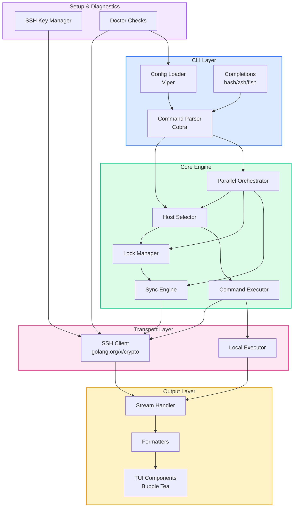
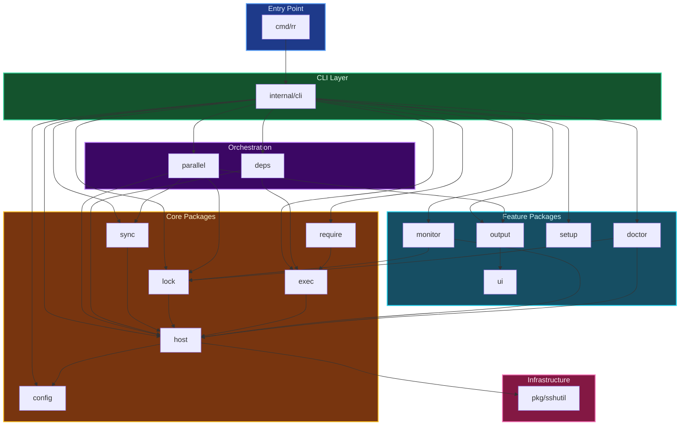
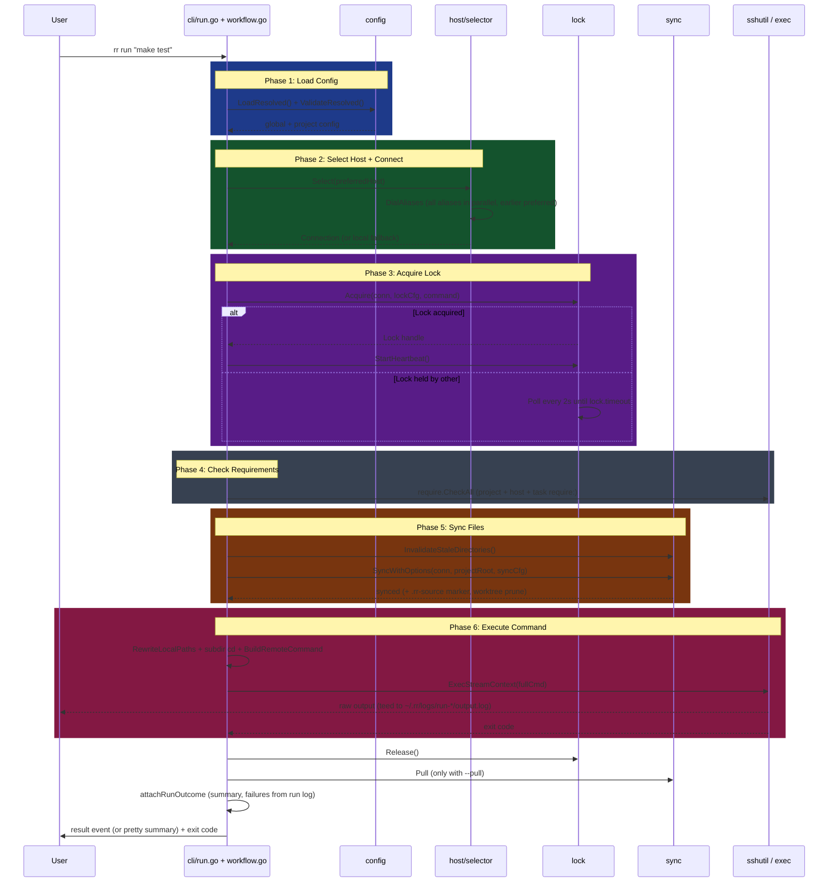
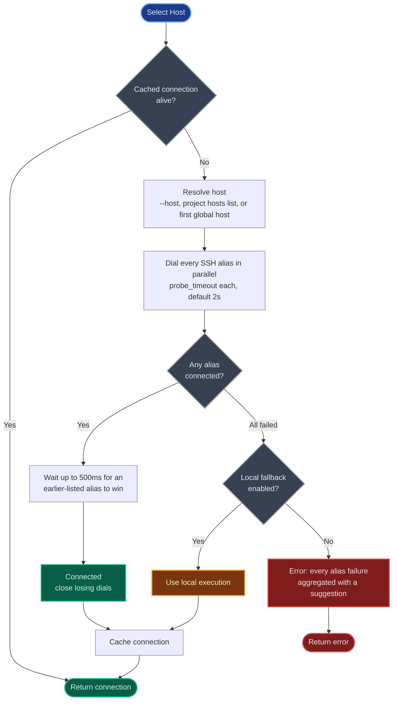
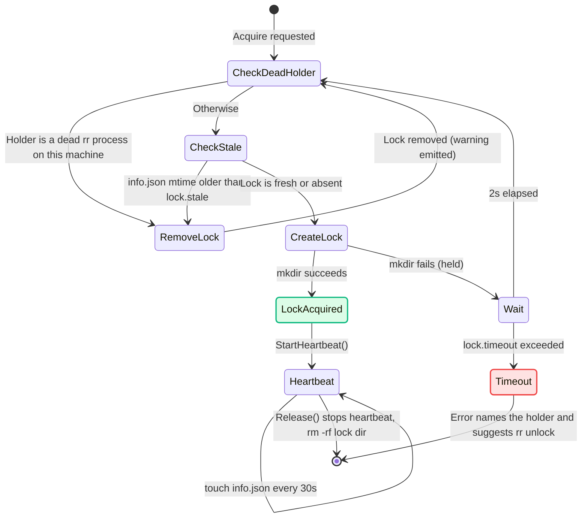
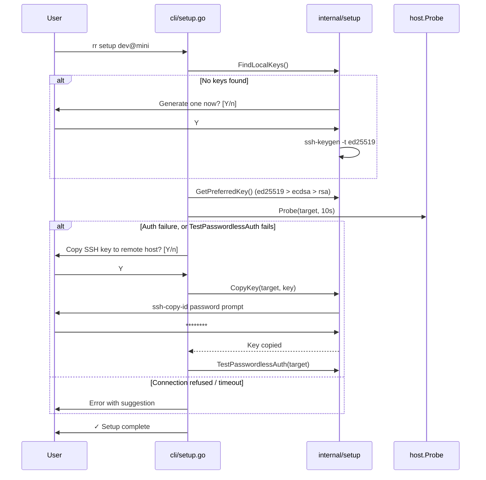
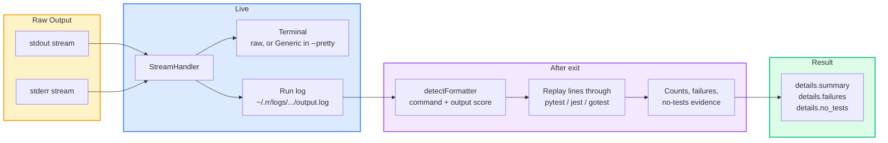
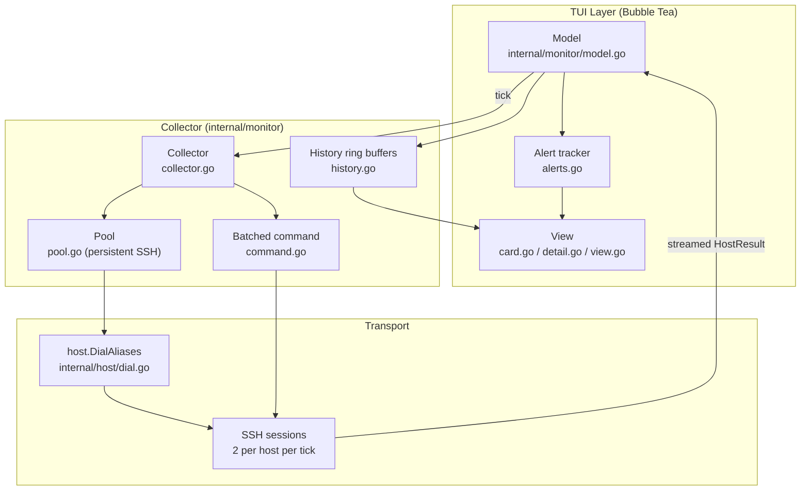

# Road Runner CLI: Architecture Plan

## TL;DR

**Road Runner** (`rr`) is a CLI tool that syncs local code to remote machines and executes commands, with smart host fallback (LAN → VPN → local), atomic locking, and beautiful output formatting. Built in **Go** for single-binary distribution, zero dependencies, and fast execution. The tool fills a gap between "just rsync && ssh" scripts and heavyweight tools like Ansible - targeting solo developers and small teams with shared build machines, home labs, or Mac Mini clusters.

---

## Problem Statement

### The Pain

Developers working with remote build machines face a fragmented workflow:

1. **Manual host management**: When working from different locations (home LAN vs. coffee shop via Tailscale), you need to remember which SSH alias works. Connection failures waste time.

2. **Repeated rsync incantations**: Complex exclude patterns, preserve rules, and delete flags are buried in shell history or scattered scripts.

3. **Concurrent access conflicts**: Two developers (or the same person in two terminals) running tests simultaneously on a shared machine causes corruption, race conditions, or misleading results.

4. **Lost output context**: When a remote test fails, you get a wall of text. Scrolling to find the actual failure is tedious. Copying paths back to your local editor requires mental translation.

5. **Tool overkill**: Ansible requires inventory files, YAML playbooks, and Python dependencies. Fabric requires Python and custom code. For "sync my code, run pytest," this is excessive.

### Who This Solves For

**Primary persona: Solo developer with a home lab**

- Has a Mac Mini or Linux box for running tests, ML training, or builds
- Works from multiple locations (home LAN, remote via Tailscale/WireGuard)
- Wants "it just works" without thinking about which host to use
- Values beautiful terminal output and fast iteration

**Secondary persona: Small team sharing a build server**

- 2-5 developers sharing a powerful machine for CI-like tasks
- Need to avoid stepping on each other's toes
- Don't want to set up a full CI system for internal dev workflows

**Non-goals (who this isn't for):**

- Large teams needing fleet management → use Ansible
- Container-native workflows → use DevPod or Tilt
- Continuous deployment → use proper CI/CD

### Why Now

The rise of Tailscale and similar mesh VPNs has made remote development practical without complex networking. Developers increasingly have "build boxes" that are sometimes local, sometimes remote. Existing tools don't handle this gracefully.

---

## Product Requirements

### Core Functionality

| Feature                   | Priority | Description                                              |
| ------------------------- | -------- | -------------------------------------------------------- |
| Smart host selection      | P0       | Try hosts in order (LAN → VPN → local fallback)          |
| File sync                 | P0       | rsync with configurable excludes and preserves           |
| Command execution         | P0       | Run arbitrary commands on selected host                  |
| Atomic locking            | P0       | Prevent concurrent runs with timeout and stale detection |
| Configuration file        | P0       | YAML config for hosts, sync rules, and tasks             |
| Streaming output          | P0       | Real-time stdout/stderr with proper TTY handling         |
| Exit code propagation     | P0       | Correct exit codes for scripting/CI integration          |
| SSH key setup helper      | P0       | Guided setup for SSH key authentication                  |
| Task definitions          | P1       | Named tasks with pre-configured commands                 |
| Output formatters         | P1       | Pluggable formatters (generic, pytest, jest, go test)    |
| Shell completions         | P1       | Bash, zsh, fish completions                              |
| Multi-host load balancing | P2       | First unlocked host in priority order, wait when all busy |
| Parallel task execution   | P2       | Run multiple tasks concurrently on different hosts       |

---

## Developer Experience Design

### Design Principles

1. **Zero to working in 60 seconds**: First successful run should happen within a minute of install
2. **Progressive disclosure**: Simple things simple, complex things possible
3. **Errors that teach**: Every error message explains what went wrong AND how to fix it
4. **Minimal surprise**: Behave like tools developers already know
5. **Quiet success, loud failure**: Don't spam on success; be helpful on failure

### Command Structure

After reviewing several naming approaches, here's the final CLI design:

```
rr <command> [options] [arguments]

Primary Commands:
  run <cmd>         Sync files and execute a command on remote
  exec <cmd>        Execute command without syncing (when you just ran sync)
  sync              Sync files only, no command execution
  pull <patterns>   Pull files from the remote project dir to local
  <task>            Run a named task (if defined in config)
  tasks             List tasks defined in .rr.yaml

Setup & Status:
  init              Create starter config with guided prompts
  setup <host>      Configure SSH keys for a host
  host              Manage hosts in ~/.rr/config.yaml (add, list, remove)
  provision         Install tools listed under require: on remote hosts
  status            Show connectivity and selected host
  monitor           Real-time dashboard of host metrics (--once for a snapshot)
  doctor            Diagnose common issues

Maintenance:
  unlock [host]     Release a stuck lock on a remote host (--all for every project host)
  prune             Remove remote sync dirs for deleted git worktrees
  logs              List run logs in ~/.rr/logs (logs clean to prune them)
  update            Update rr to the latest release

Help:
  help [command]    Show help for a command
  version           Show version info
```

**Key design decisions:**

1. **Tasks are first-class citizens**: If you define a task called `test`, you run it with `rr test`, not `rr task test`. This matches `make`, `npm run`, and muscle memory.

2. **`run` vs `exec`**: `run` always syncs first (the common case). `exec` skips sync for when you're iterating quickly and just changed one file you already synced.

3. **`setup` is prominent**: New users will need this. It's not hidden under `rr config ssh-setup`.

4. **`doctor` for debugging**: When things don't work, `rr doctor` checks everything and reports issues.

### Command Naming Rationale

| Considered         | Chosen      | Why                                         |
| ------------------ | ----------- | ------------------------------------------- |
| `rr task test`     | `rr test`   | Shorter, matches make/npm patterns          |
| `rr run --no-sync` | `rr exec`   | Common enough to deserve its own command    |
| `rr hosts`         | `rr status` | Status shows hosts AND current selection    |
| `rr ssh-setup`     | `rr setup`  | More discoverable, allows future expansion  |
| `rr check`         | `rr doctor` | "Doctor" implies diagnosis and prescription |

### Reserved Command Names

These names cannot be used as task names (`ReservedTaskNames` in `internal/config/validate.go`):

```
run, exec, sync, prune, init, setup, status, monitor, doctor, help, version, completion, update, host, unlock, tasks
```

If a user has a task named `run`, config validation fails:

```
Can't use 'run' as a task name - that's a built-in command
  Pick a different name, like 'my-run' or 'do-run'.
```

---

## Terminal Output States

### Output Modes

Structured output is the default for every command. Workflow commands (`run`, `exec`, `sync`, tasks) write one JSON event per line to stderr and pass the command's own stdout/stderr through untouched. `--pretty` (`-p`) switches to the spinner and color UI shown in the examples below. `--machine` (`-m`) is kept for compatibility and does nothing, since structured is already the default. `--no-phases` drops the intermediate `phase` events and keeps the final `result` event.

The split lives in `internal/cli/phase_reporter.go`: `NewPhaseReporter` returns a `StructuredReporter` (JSON events via `WritePhaseEvent` in `internal/cli/json.go`) or a `PrettyReporter` (wraps `ui.PhaseDisplay`).

```
{"type":"phase","phase":"connect","status":"complete","host":"mini","duration_s":0.12,"ts":"..."}
{"type":"phase","phase":"lock","status":"complete","host":"mini","duration_s":0.05,"ts":"..."}
{"type":"phase","phase":"sync","status":"complete","host":"mini","duration_s":1.2,"ts":"..."}
{"type":"phase","phase":"exec","status":"started","details":{"command":"pytest -n auto"},"ts":"..."}
{"type":"result","status":"failed","exit_code":1,"host":"mini","duration_s":4.8,"details":{"exec_duration_s":3.3,"log_file":"~/.rr/logs/run-20260101-120000/output.log","summary":{"passed":45,"failed":2,"skipped":0,"errors":0},"failures":[...]},"ts":"..."}
```

Keys that can appear in the result `details` include `log_file`, `summary`, `failures`, `no_tests`, `piped_exit_code`, `hint`, `path_rewrites`, `remote_cwd`, `fallback`, and `broken_pipe`. Sync can also emit `warn` (provenance mismatch), `invalidated` (lockfile-triggered directory removal) and `pruned` (stale worktree dir) events, and lock can emit `warn` when it steals a stale or dead-holder lock.

### State Indicators

In `--pretty` mode, every operation goes through clear phases with consistent visual language:

```
PHASE INDICATORS:
  ○  Pending (not started)
  ◐  In progress (animated spinner)
  ●  Complete (success)
  ✗  Failed
  ⊘  Skipped

COLORS:
  Blue     → In progress, informational
  Green    → Success
  Yellow   → Warning, skipped
  Red      → Error, failure
  Dim/Gray → Secondary info, timing
```

### Example: Successful Run

```bash
$ rr test --pretty

◐ Connecting...
● Connected to mini via mini-local                          0.1s

◐ Acquiring lock...
● Lock acquired                                             0.0s

◐ Syncing 234 files...
● Synced                                                    1.2s

━━━━━━━━━━━━━━━━━━━━━━━━━━━━━━━━━━━━━━━━━━━━━━━━━━━━━━━━━━━━━━━━

$ pytest -n auto
======================== test session starts =========================
...
======================== 47 passed in 3.21s ===========================

━━━━━━━━━━━━━━━━━━━━━━━━━━━━━━━━━━━━━━━━━━━━━━━━━━━━━━━━━━━━━━━━

● Done                                                      4.8s
```

### Example: Connection Fallback

```bash
$ rr test

◐ Connecting...
  ● mini (tailscale)                                        0.3s
● Connected to mini via mini (tailscale)                    0.8s

◐ Acquiring lock...
...
```

Both aliases are dialed at once. The Tailscale alias answered first, so rr waited the 500ms preference window for `mini-local` and then settled. A dead LAN address costs at most that grace period, not a full probe timeout. Alias failures that arrive before a winner is chosen are listed with a `○`.

### Example: Failed Command with Pytest Formatter

```bash
$ rr test

● Connected to mini via mini-local                          0.1s
● Lock acquired                                             0.0s
● Synced (47 files)                                         0.8s

━━━━━━━━━━━━━━━━━━━━━━━━━━━━━━━━━━━━━━━━━━━━━━━━━━━━━━━━━━━━━━━━

$ pytest -n auto
...
FAILED tests/test_auth.py::test_login_expired - AssertionError
FAILED tests/test_users.py::test_duplicate - IntegrityError
...
======================== 2 failed, 45 passed in 3.21s =================

━━━━━━━━━━━━━━━━━━━━━━━━━━━━━━━━━━━━━━━━━━━━━━━━━━━━━━━━━━━━━━━━

✗ 2 tests failed                                            4.1s

  tests/test_auth.py:42
    test_login_expired
    AssertionError: Expected 401, got 200

  tests/test_users.py:108
    test_duplicate
    IntegrityError: duplicate key value violates unique constraint

```

This per-failure block is what parallel task groups print through `parallel.RenderSummary`. For a single command or task, the same parsed data goes into `details.summary` and `details.failures` in the structured result; the pretty-mode renderer for single runs (`explainRunFailure` in `internal/cli/run.go`) only fires when the stream formatter provides test results, and single runs currently install `GenericFormatter`, which doesn't.

### Example: Lock Contention

```bash
$ rr test

● Connected to mini via mini-local                          0.1s

◐ Waiting for lock...
  Held by: alice@macbook since 2m ago

◐ Waiting for lock... (30s)
● Lock acquired                                            34.2s
● Synced (12 files changed)                                 0.3s
...
```

The lock is taken before sync so rr never overwrites files under a command that another run is still executing.

### Example: SSH Setup

`rr setup` takes one SSH target (an alias from `~/.ssh/config` or `user@host`) and does not edit rr's config. Hosts are added with `rr host add` or `rr init`.

```bash
$ rr setup dev@192.168.1.50

Setting up SSH for 'dev@192.168.1.50'

✓ Using SSH key: ~/.ssh/id_ed25519 (ed25519)

◐ Testing SSH connection...
✗ Testing SSH connection

○ Connection works but authentication failed

? Copy SSH key to remote host? [Y/n] y

  dev@192.168.1.50's password: ********

● Copying SSH key
● Verifying passwordless login

✓ Setup complete for 'dev@192.168.1.50'

You can now:
  rr init        - Create a config file using this host
  rr sync        - Sync files to remote
  rr run <cmd>   - Run commands remotely
```

### Example: Doctor Output

```bash
$ rr doctor

Road Runner Diagnostic Report

CONFIG
  ● Config file: .rr.yaml
  ● Schema valid
  ● 1 host configured, 2 tasks defined

SSH
  ● SSH key found: ~/.ssh/id_ed25519.pub
  ● SSH agent running with 2 keys loaded

HOSTS
  ● mini
    ● mini-local: Connected (11ms)
    ● mini: Connected (52ms)

DEPENDENCIES
  ● rsync 3.2.7 (local)
  ● rsync 3.2.3 (mini)

REMOTE
  ● Working directory exists: ~/projects/myapp
  ● Write permission: OK
  ● No stale locks found

━━━━━━━━━━━━━━━━━━━━━━━━━━━━━━━━━━━━━━━━━━━━━━━━━━━━━━━━━━━━━━━━

✓ Everything looks good
```

### Example: Doctor with Issues

```bash
$ rr doctor

Road Runner Diagnostic Report

CONFIG
  ● Config file: .rr.yaml
  ✗ Schema error at tasks.test.on_failure
    Invalid value "skip". Expected: continue, stop

    Fix: Change to one of the valid values

SSH
  ● SSH key found: ~/.ssh/id_ed25519.pub
  ✗ SSH agent not running

    Fix: eval $(ssh-agent) && ssh-add

HOSTS
  ✗ mini
    ✗ mini-local: Connection refused
    ● mini: Connected (52ms)

    mini-local may be offline or firewalled

━━━━━━━━━━━━━━━━━━━━━━━━━━━━━━━━━━━━━━━━━━━━━━━━━━━━━━━━━━━━━━━━

✗ 3 issues found

  Run with --fix to attempt automatic fixes where possible.
```

---

## Error Message Design

Every error follows this structure:

```
✗ <What failed>

  <Why it failed — technical details>

  <How to fix it — actionable steps>
```

### Error Examples

**Host unreachable:**

```
✗ Cannot connect to any configured hosts

  mini-local: Connection timed out after 2s
  mini: Connection refused

  Possible causes:
    • Host is offline or sleeping
    • Firewall blocking SSH (port 22)
    • Tailscale not connected

  Try:
    rr doctor          Check full diagnostic
    rr status          See host configuration
```

**Lock held:**

```
✗ Lock timeout after 5m0s - someone else is using this remote

  Lock holder: <user, pid, command and age from info.json>. Wait for it to
  finish or run 'rr unlock mini' if it's stuck.
```

There is no flag to force or extend a single run's lock wait. Stuck locks are released with `rr unlock`, and the wait is set by `lock.timeout` in `.rr.yaml`. Locks whose holder stopped heartbeating (older than `lock.stale`, default 90s) and locks held by a dead `rr` process on the same machine are reclaimed automatically with a warning.

**Config error:**

```
✗ task 'ci' step 3 has on_fail='skip' but it needs to be 'stop' or 'continue'

  Check your task config in .rr.yaml.
```

Validation (`internal/config/validate.go`) checks values after parsing. Unknown keys are ignored by the Viper/mapstructure decode rather than reported with line numbers.

**rsync not found:**

```
✗ rsync not found on remote host

  Host: mini (mini-local)
  PATH searched: /usr/bin:/usr/local/bin:/opt/homebrew/bin

  Install rsync on the remote:
    macOS:  brew install rsync
    Ubuntu: sudo apt install rsync
    Fedora: sudo dnf install rsync
```

---

## Configuration Schema

### File Location

`rr` uses two configuration files:

**Global config** (`~/.rr/config.yaml`):
- Contains host definitions (SSH connections, remote directories, tags, env vars)
- Personal settings not shared with team
- Created with `rr host add` or manually

**Project config** (`.rr.yaml`):
- Contains sync rules, tasks, output settings
- Shareable with team via version control
- Created with `rr init`

Project config is loaded from (first match wins):

1. `--config` flag
2. `.rr.yaml` in current directory
3. `.rr.yaml` in parent directories (stops at git root or home)

**Design decision**: Use `.rr.yaml` not `.road-runner.yaml`. It's shorter, matches the command name, and follows the pattern of `.npmrc`, `.nvmrc`, etc.

### Complete Schema

**Global config** (`~/.rr/config.yaml`):

```yaml
# ~/.rr/config.yaml
# Personal host definitions

version: 1

# ─────────────────────────────────────────────────────────────────────────────
# HOSTS
# Define remote machines and their connection methods
# ─────────────────────────────────────────────────────────────────────────────

hosts:
  # Host name (used in commands: rr run --host=mini)
  mini:
    # SSH connection strings, tried in order until one succeeds
    # Can be: hostname, user@hostname, or SSH config alias
    ssh:
      - mini-local # Try first (LAN, usually faster)
      - mini # Fallback (Tailscale/VPN)
      - dev@192.168.1.50 # Explicit user@host also works

    # Working directory on remote (where files sync to)
    # Supports variable expansion: ${PROJECT}, ${USER}
    dir: ~/projects/${PROJECT}

    # Optional tags for filtering (used with --tag flag)
    tags: [macos, arm64, fast]

  gpu-box:
    ssh:
      - gpu.local
      - gpu-tailscale
    dir: /home/dev/projects/${PROJECT}
    tags: [linux, gpu, cuda]

    # Optional: environment variables for this host
    env:
      CUDA_VISIBLE_DEVICES: "0,1"

    # Optional: shell used to run commands (default: $SHELL -l -c)
    shell: "bash -o pipefail -c"

    # Optional: commands prepended to every command on this host
    setup_commands:
      - source ~/.cargo/env

    # Optional: tools that must exist on this host (see rr provision)
    require: [nvidia-smi]

# ─────────────────────────────────────────────────────────────────────────────
# DEFAULTS
# Personal default settings
# ─────────────────────────────────────────────────────────────────────────────

defaults:
  # Local execution fallback: never (default), on-unreachable, or always.
  # on-unreachable: run locally only when no host can be reached.
  # always: also run locally when every host is locked (after lock.wait_timeout
  # if the holder is on this machine). Booleans still parse: true = always.
  local_fallback: never

  # SSH probe timeout
  probe_timeout: 2s

  # Rewrite local absolute paths in commands to the remote project dir
  rewrite_paths: true

# ─────────────────────────────────────────────────────────────────────────────
# LOGS
# Run log retention (single runs and parallel tasks)
# ─────────────────────────────────────────────────────────────────────────────

logs:
  dir: ~/.rr/logs
  keep_runs: 10     # per task name; 0 disables run-count cleanup
  keep_days: 0      # 0 = disabled
  max_size_mb: 0    # 0 = disabled
```

There is no default host setting. Host priority comes from the order of the project's `hosts:` list, or alphabetical order when the project doesn't name hosts.

**Project config** (`.rr.yaml`):

```yaml
# .rr.yaml
# Road Runner project configuration
# Docs: https://github.com/rileyhilliard/rr/blob/main/docs/configuration.md

# Schema version (for future migrations)
version: 1

# ─────────────────────────────────────────────────────────────────────────────
# HOST REFERENCES
# Reference hosts defined in ~/.rr/config.yaml
# ─────────────────────────────────────────────────────────────────────────────

# List of hosts this project can use for load balancing
# If omitted, all global hosts are available
hosts:
  - mini
  - gpu-box

# Or use a single host (mutually exclusive with hosts:)
# host: mini

# Overrides defaults.local_fallback from the global config.
# With a non-never mode and no hosts listed here, rr runs locally.
local_fallback: on-unreachable

# Overrides defaults.rewrite_paths from the global config
rewrite_paths: true

# setup is prepended to tasks and ad-hoc commands (after host setup_commands).
# env applies to tasks: host env < project defaults env < task env.
defaults:
  setup:
    - source .venv/bin/activate
  env:
    PYTHONUNBUFFERED: "1"

# Tools every host must have before sync (checked in the requirements phase)
require: [python3, uv]

# ─────────────────────────────────────────────────────────────────────────────
# SYNC
# Configure file synchronization behavior
# ─────────────────────────────────────────────────────────────────────────────

sync:
  # Translate .gitignore into rsync filter rules (default: true)
  respect_gitignore: true

  # Patterns to exclude from sync (not sent to remote)
  # Uses rsync pattern syntax. A custom list replaces the defaults below.
  # .git, .venv and node_modules are bare patterns because in a linked
  # worktree .git is a file and node_modules may be a symlink.
  exclude:
    - .git
    - .venv
    - __pycache__/
    - "*.pyc"
    - node_modules
    - .mypy_cache/
    - .pytest_cache/
    - .ruff_cache/
    - .DS_Store
    - "*.log"
    - .claude/
    - .cursor/
    - .aider/
    - .copilot/

  # Patterns to preserve on remote (not deleted even if missing locally)
  # Useful for: virtual environments, downloaded data, build caches
  preserve:
    - .venv/
    - node_modules/
    - data/
    - .cache/

  # Extra rsync flags (optional)
  # Common additions: --compress, --info=progress2
  flags: []

  # Delete preserved remote dirs when a lockfile changes locally, so a stale
  # node_modules/.venv isn't reused. Defaults cover bun, npm, yarn, pnpm,
  # poetry and pipenv lockfiles.
  invalidations:
    - lockfile: bun.lock
      dirs: [node_modules/]

  # Linked git worktrees sync to "<repo>@<worktree>" instead of "<repo>"
  # (default: true)
  worktree_isolation: true

  # After each sync, remove "<repo>@<worktree>" dirs on that host whose
  # worktree no longer exists locally (default: true). See rr prune.
  prune_worktrees: true

# ─────────────────────────────────────────────────────────────────────────────
# LOCK
# Prevent concurrent executions on shared hosts
# ─────────────────────────────────────────────────────────────────────────────

lock:
  # Enable/disable locking (default: true)
  enabled: true

  # How long to wait for a single host's lock before giving up
  timeout: 5m

  # With multiple hosts, how long to cycle through them when all are locked
  wait_timeout: 1m

  # A lock whose info.json hasn't been touched for this long is stale.
  # Holders heartbeat every 30s, so this only trips when the holder died.
  stale: 90s

  # Parent directory for the lock on the remote (lock is <dir>/rr.lock/).
  # Coordination is path-based: projects share a lock only if they use the
  # same dir on the same host. Different lock.dir values mean separate locks.
  dir: /tmp/rr-locks

# ─────────────────────────────────────────────────────────────────────────────
# TASKS
# Named command sequences (like Makefile targets)
# Run with: rr <taskname>
# ─────────────────────────────────────────────────────────────────────────────

tasks:
  # Simple task: single command
  build:
    run: make build

  # Task with description (shown in rr --help)
  test:
    description: Run all tests
    run: pytest -n auto

  # Task restricted to specific hosts
  train:
    description: Run ML training job
    hosts: [gpu-box] # Only runs on hosts with GPU
    run: python train.py
    env:
      WANDB_MODE: offline

  # Multi-step task
  ci:
    description: Full CI pipeline
    steps:
      - name: lint
        run: ruff check .

      - name: typecheck
        run: mypy .

      - name: test
        run: pytest -n auto
        on_fail: continue # Keep going even if tests fail

      - name: build
        run: make build

  # Dependencies run first; a {parallel: [...]} item runs as one concurrent stage
  release:
    depends: [{parallel: [lint, typecheck]}, test]
    run: make release

  # Parallel group: subtasks are spread across hosts by internal/parallel
  test-all:
    parallel: [test-unit, test-integration]
    setup: uv sync        # once per host, before any subtask
    fail_fast: false
    max_parallel: 0       # 0 = unlimited

  test-unit:
    run: pytest tests/unit {args}   # {args} / {args:-default} placeholders
    pull: [coverage.xml]            # fetched after the command, pass or fail

  test-integration:
    hosts: [gpu-box]                # pins this subtask, honored in parallel runs too
    run: pytest tests/integration

# ─────────────────────────────────────────────────────────────────────────────
# OUTPUT
# Configure terminal output formatting
# ─────────────────────────────────────────────────────────────────────────────

output:
  # Every key in this section is validated at load time but not read
  # anywhere else yet. Color is on only with --pretty and off with --no-color; test
  # output is always auto-detected (pytest, jest/vitest, go test).

  # Color mode: auto, always, never
  color: auto

  # Accepted: auto, generic, pytest, jest, go, cargo (there is no cargo formatter)
  format: auto

  timing: true

  # Verbosity: quiet, normal, verbose
  verbosity: normal
```

### Schema Design Decisions

| Decision                   | Rationale                                        |
| -------------------------- | ------------------------------------------------ |
| `exclude` not `excludes`   | Matches rsync terminology, reads naturally       |
| `preserve` not `preserves` | Consistent with `exclude`                        |
| `dir` not `workdir`        | Shorter, still clear                             |
| `steps` not `commands`     | Implies ordered sequence, matches CI terminology |
| `on_fail` not `on_failure` | Shorter, common in CI configs                    |
| `stale` not `stale_after`  | Context makes it clear                           |

### Minimal Config

For the simplest case, you need at least one host in your global config:

```yaml
# ~/.rr/config.yaml
hosts:
  mini:
    ssh: [mini-local, mini]
    dir: ~/projects/${PROJECT}
```

A project config (`.rr.yaml`) is optional. Everything else has sensible defaults. This enables:

```bash
rr run "pytest"
rr run "make build"
```

### Zero-Config Mode

There is no interactive setup inside `rr run`. With no hosts in `~/.rr/config.yaml`, `config.ResolveHosts` returns a config error that points at `rr init` (no project config) or `rr host add` (project config present). The exception is local mode: if `local_fallback` is set to a non-`never` mode and there are no hosts, or the project sets `local_fallback` without listing hosts, commands run locally with no sync or lock.

---

## Technical Architecture

### Language Choice: Go

**Decision**: Build in Go, not TypeScript or Python.

**Rationale:**

| Factor                     | Go                         | TypeScript                | Python                  |
| -------------------------- | -------------------------- | ------------------------- | ----------------------- |
| Single binary distribution | ✅ Yes                     | ❌ Needs Node.js          | ❌ Needs Python         |
| Cross-compilation          | ✅ Trivial                 | ⚠️ Possible but complex   | ❌ Difficult            |
| Startup time               | ✅ ~10ms                   | ❌ ~200-500ms             | ❌ ~100-300ms           |
| SSH libraries              | ✅ golang.org/x/crypto/ssh | ⚠️ ssh2 (native bindings) | ✅ Paramiko             |
| CLI frameworks             | ✅ Cobra (excellent)       | ✅ Commander/yargs        | ✅ Click/Typer          |
| Concurrency                | ✅ Goroutines              | ⚠️ Event loop limits      | ⚠️ Threading is awkward |

The killer feature is **single binary distribution**. Users run `brew install rr` or download a binary—no runtime dependencies. This matches the "just works" philosophy.

Go's SSH library means probing, locking and command execution don't shell out to `ssh`, giving us better error handling, connection reuse, and cross-platform consistency. File transfer is the exception: `rr sync` and `rr pull` run the system `rsync`, which uses the system `ssh` with a ControlMaster socket under `/tmp/rr-ssh-<uid>` so repeated transfers reuse one connection.

### System Architecture


```mermaid
flowchart TB
    subgraph cli["CLI Layer"]
        cmd[Command Parser<br/>Cobra]
        cfg[Config Loader<br/>Viper]
        comp[Completions<br/>bash/zsh/fish]
    end

    subgraph core["Core Engine"]
        host[Host Selector]
        sync[Sync Engine]
        exec[Command Executor]
        lock[Lock Manager]
        par[Parallel Orchestrator]
    end

    subgraph output["Output Layer"]
        stream[Stream Handler]
        fmt[Formatters]
        tui[TUI Components<br/>Bubble Tea]
    end

    subgraph transport["Transport Layer"]
        ssh[SSH Client<br/>golang.org/x/crypto]
        local[Local Executor]
    end

    subgraph setup["Setup & Diagnostics"]
        keys[SSH Key Manager]
        doctor[Doctor Checks]
    end

    cmd --> host
    cmd --> par
    cfg --> cmd
    comp --> cmd
    host --> lock
    lock --> sync
    host --> exec
    par --> host
    par --> lock
    par --> sync
    sync --> ssh
    exec --> ssh
    exec --> local
    ssh --> stream
    local --> stream
    stream --> fmt
    fmt --> tui
    keys --> ssh
    doctor --> ssh
    doctor --> cfg

    style cli fill:#dbeafe,stroke:#3b82f6,stroke-width:2px
    style core fill:#dcfce7,stroke:#10b981,stroke-width:2px
    style output fill:#fef3c7,stroke:#f59e0b,stroke-width:2px
    style transport fill:#fce7f3,stroke:#ec4899,stroke-width:2px
    style setup fill:#f3e8ff,stroke:#a855f7,stroke-width:2px
```

### Component Responsibilities

**CLI Layer**

- Parse commands and flags using Cobra
- Load the global and project YAML files with Viper and merge them into a `config.ResolvedConfig` (no environment-variable overrides)
- Register each task in `.rr.yaml` as a top-level Cobra command at startup, which is how task names show up in completions
- Rewrite local absolute paths in commands to the remote project dir (`pathrewrite.go`)
- Emit structured JSON phase and result events, or pretty output with `--pretty` (`phase_reporter.go`, `json.go`)
- Tee command output to a per-run log and extract test summaries from it (`runlog.go`)
- Validate inputs before passing to core

**Core Engine**

- **Host Selector**: Resolve which hosts the project may use, dial each host's SSH aliases in parallel (earlier aliases preferred), cache the connection, handle local fallback. Multi-host load balancing (try-lock each host, wait when all are busy) lives in `internal/cli/loadbalance.go`.
- **Sync Engine**: Build the rsync command with excludes/preserves and `.gitignore` filters, invalidate stale install dirs, write the `.rr-source` provenance marker, prune stale worktree dirs, show progress
- **Command Executor**: Execute commands via SSH or locally, handle streaming output, run task steps
- **Lock Manager**: Acquire/release the per-host lock, heartbeat while held, reclaim stale and dead-holder locks, handle timeout
- **Parallel Orchestrator**: Spread a parallel task's subtasks across hosts with a work-stealing queue (`internal/parallel`)

**Output Layer**

- **Stream Handler**: Multiplex stdout/stderr, buffer lines, tee raw output to the run log, survive broken pipes
- **Formatters**: Parse output for known tools (pytest, jest/vitest, go test), extract counts and failures
- **TUI Components**: Progress indicators, spinners, colored output using Bubble Tea

**Transport Layer**

- **SSH Client** (`pkg/sshutil`): Dial using `~/.ssh/config` settings (including ProxyCommand), agent and key-file auth, exec/stream/PTY/interactive/shell modes
- **Local Executor**: os/exec wrapper for `--local` and local fallback

**Setup & Diagnostics**

- **SSH Key Manager**: Check for keys, generate if needed, run ssh-copy-id
- **Doctor Checks**: Validate config, test connectivity, check dependencies, check remote dirs and stale locks, check `require:` tools, flag worktrees that share a remote dir
- **Requirements and provisioning**: `internal/require` checks `require:` tools on the remote (cached per host) before sync; `rr provision` installs missing ones with the installers in `internal/exec/provision.go`

### Package Dependencies

This diagram shows the main internal packages and their key imports. Leaf utility packages (`errors`, `util`, `logger`) are left out:


```mermaid
flowchart TB
    subgraph entry["Entry Point"]
        cmd[cmd/rr]
    end

    subgraph cli_layer["CLI Layer"]
        cli[internal/cli]
    end

    subgraph orchestration["Orchestration"]
        parallel[parallel]
        deps[deps]
    end

    subgraph core["Core Packages"]
        host[host]
        sync[sync]
        lock[lock]
        exec[exec]
        config[config]
        require[require]
    end

    subgraph features["Feature Packages"]
        monitor[monitor]
        doctor[doctor]
        setup[setup]
        output[output]
        ui[ui]
    end

    subgraph infra["Infrastructure"]
        sshutil[pkg/sshutil]
    end

    cmd --> cli

    cli --> parallel
    cli --> deps
    cli --> host
    cli --> sync
    cli --> lock
    cli --> exec
    cli --> config
    cli --> require
    cli --> monitor
    cli --> doctor
    cli --> setup
    cli --> output

    parallel --> host
    parallel --> lock
    parallel --> sync
    parallel --> output
    deps --> exec
    deps --> host

    host --> config
    host --> sshutil
    sync --> host
    lock --> host
    exec --> host
    require --> exec
    monitor --> host
    monitor --> lock
    doctor --> host
    doctor --> lock
    output --> ui

    style entry fill:#1e3a8a,stroke:#60a5fa,stroke-width:2px,color:#dbeafe
    style cli_layer fill:#14532d,stroke:#34d399,stroke-width:2px,color:#dcfce7
    style orchestration fill:#3b0764,stroke:#c084fc,stroke-width:2px,color:#f3e8ff
    style core fill:#78350f,stroke:#fbbf24,stroke-width:2px,color:#fef3c7
    style features fill:#164e63,stroke:#22d3ee,stroke-width:2px,color:#cffafe
    style infra fill:#831843,stroke:#f472b6,stroke-width:2px,color:#fce7f3
```

**Key dependencies:**
- `cmd/rr` is the entry point, calls `internal/cli`
- `cli` orchestrates everything; `workflow.go` drives the connect, lock, requirements and sync phases shared by `run`, `exec`, `sync` and tasks
- `parallel` runs parallel task groups and reuses `host`, `lock` and `sync` per host worker; `parallel/logs` writes run logs for both parallel and single runs
- `deps` resolves `depends:` chains into stages and runs them through `exec`
- `host` uses `pkg/sshutil` for SSH operations
- `sync`, `lock`, `exec`, `monitor` and `doctor` all take a `host.Connection`

### The `rr run` Command Flow

This sequence diagram shows what happens when you run `rr run "make test"`. Phases 1 through 5 live in `SetupWorkflow` (`internal/cli/workflow.go`) and are shared with `exec` (which skips sync), `sync` (which skips execution) and task commands. `Run` in `internal/cli/run.go` handles the rest.


```mermaid
sequenceDiagram
    participant User
    participant CLI as cli/run.go + workflow.go
    participant Config as config
    participant Host as host/selector
    participant Lock as lock
    participant Sync as sync
    participant Exec as sshutil / exec

    User->>CLI: rr run "make test"

    rect rgb(30, 58, 138)
        Note over CLI,Config: Phase 1: Load Config
        CLI->>Config: LoadResolved() + ValidateResolved()
        Config-->>CLI: global + project config
    end

    rect rgb(20, 83, 45)
        Note over CLI,Host: Phase 2: Select Host + Connect
        CLI->>Host: Select(preferredHost)
        Host->>Host: DialAliases (all aliases in parallel, earlier preferred)
        Host-->>CLI: Connection (or local fallback)
    end

    rect rgb(88, 28, 135)
        Note over CLI,Lock: Phase 3: Acquire Lock
        CLI->>Lock: Acquire(conn, lockCfg, command)
        alt Lock acquired
            Lock-->>CLI: Lock handle
            CLI->>Lock: StartHeartbeat()
        else Lock held by other
            Lock->>Lock: Poll every 2s until lock.timeout
        end
    end

    rect rgb(55, 65, 81)
        Note over CLI: Phase 4: Check Requirements
        CLI->>Exec: require.CheckAll (project + host + task require:)
    end

    rect rgb(120, 53, 15)
        Note over CLI,Sync: Phase 5: Sync Files
        CLI->>Sync: InvalidateStaleDirectories()
        CLI->>Sync: SyncWithOptions(conn, projectRoot, syncCfg)
        Sync-->>CLI: synced (+ .rr-source marker, worktree prune)
    end

    rect rgb(131, 24, 67)
        Note over CLI,Exec: Phase 6: Execute Command
        CLI->>CLI: RewriteLocalPaths + subdir cd + BuildRemoteCommand
        CLI->>Exec: ExecStreamContext(fullCmd)
        Exec-->>User: raw output (teed to ~/.rr/logs/run-*/output.log)
        Exec-->>CLI: exit code
    end

    CLI->>Lock: Release()
    CLI->>Sync: Pull (only with --pull)
    CLI->>CLI: attachRunOutcome (summary, failures from run log)
    CLI->>User: result event (or pretty summary) + exit code
```

**Phase summary:**
1. **Load Config** - Find and parse `.rr.yaml` (walking up from the cwd) and `~/.rr/config.yaml`
2. **Select Host** - Dial the host's SSH aliases in parallel, keep the preferred winner
3. **Acquire Lock** - Take the per-host lock and start the 30s heartbeat
4. **Check Requirements** - Verify `require:` tools exist on the remote; fail with a pointer to `rr provision`
5. **Sync Files** - Delete invalidated install dirs, rsync the project root, write `.rr-source`, prune stale worktree dirs
6. **Execute** - Rewrite local paths, `cd` into the matching subdirectory, run the command, stream output, capture exit code
7. **Cleanup** - Release lock, pull files if requested, extract test results from the run log, emit the result

Locking happens before sync so a run never rewrites files under another run's command. With more than one host and no `--host`/`--tag`, phases 2 and 3 are merged into `setupWorkflowLoadBalanced` (`internal/cli/loadbalance.go`): each host is connected and `lock.TryAcquire`d in priority order, the first free one wins, and only that host is synced. When every host is locked, the `local_fallback` mode decides: `always` runs locally (after waiting `lock.wait_timeout` if a holder is on this machine), otherwise rr cycles through the locked hosts until `lock.wait_timeout` and then errors. A local fallback is reported loudly (`details.fallback` in the result, repeated warning in pretty mode).

**Path rewriting** (`internal/cli/pathrewrite.go`): unless `rewrite_paths: false`, absolute paths under the local project root in an ad-hoc command are replaced with the remote project dir (`RewriteLocalPaths`, boundary-aware, symlink-aware, tilde dirs become `$HOME` form). Task args are rewritten to `./`-relative form instead (`RewriteArgsToRelative`) because each host may use a different remote dir. Rewrites are reported in `details.path_rewrites`. `checkForeignPaths` warns about remaining `/Users/` or `/home/` paths outside the project, and rejects a command whose leading `cd` targets one of them that exists locally.

**Subdirectory mapping**: when invoked from a subdirectory of the project, ad-hoc commands `cd` into the same subdirectory on the remote (a soft `cd` that falls back to the project root, reported as `details.remote_cwd`). `--cwd` sets it explicitly and fails if it escapes the project root. Named tasks run from the project root.

**Run logs** (`internal/cli/runlog.go`): every run, exec and task tees raw output to `~/.rr/logs/<name>-<timestamp>/output.log` via `logs.OpenRunLog`, using the same directory layout and retention (`logs:` in the global config) as parallel runs. After the command finishes, `attachRunOutcome` reads back the tail of that log and uses `formatters.ExtractTestSummary` and `formatters.ExtractFailures` to fill `details.summary`, `details.failures` and `details.no_tests`. `--tail N` reprints the last N log lines after the result. `rr logs` lists these directories and `rr logs clean` applies retention.

### Host Selection Flow

The host selector (`internal/host/selector.go`) resolves a host, then races that host's SSH aliases through `DialAliases` (`internal/host/dial.go`):


```mermaid
flowchart TB
    start([Select Host]) --> cached{Cached connection<br/>alive?}
    cached -->|Yes| done([Return connection])
    cached -->|No| load[Resolve host<br/>--host, project hosts list, or first global host]

    load --> dial[Dial every SSH alias in parallel<br/>probe_timeout each, default 2s]

    dial --> result{Any alias<br/>connected?}

    result -->|Yes| grace[Wait up to 500ms for an<br/>earlier-listed alias to win]
    grace --> connected[Connected<br/>close losing dials]
    result -->|All failed| fallback{Local fallback<br/>enabled?}

    fallback -->|Yes| local[Use local execution]
    fallback -->|No| fail[Error: every alias failure<br/>aggregated with a suggestion]

    connected --> cache[Cache connection]
    local --> cache
    cache --> done

    fail --> error([Return error])

    style start fill:#1e3a8a,stroke:#60a5fa,stroke-width:2px,color:#dbeafe
    style done fill:#065f46,stroke:#10b981,stroke-width:2px,color:#d1fae5
    style error fill:#7f1d1d,stroke:#ef4444,stroke-width:2px,color:#fee2e2
    style connected fill:#065f46,stroke:#10b981,stroke-width:2px,color:#d1fae5
    style local fill:#78350f,stroke:#f59e0b,stroke-width:2px,color:#fef3c7
    style fail fill:#7f1d1d,stroke:#ef4444,stroke-width:2px,color:#fee2e2
    style cached fill:#374151,stroke:#9ca3af,stroke-width:2px,color:#e5e7eb
    style result fill:#374151,stroke:#9ca3af,stroke-width:2px,color:#e5e7eb
    style fallback fill:#374151,stroke:#9ca3af,stroke-width:2px,color:#e5e7eb
```

**Selection logic:**
1. Reuse the cached connection if it is for the requested host and answers a `keepalive@openssh.com` request
2. Resolve the host: `--host`, else the project's `hosts:` list (or `host:`), else all global hosts in alphabetical order
3. Dial all of the host's SSH aliases at once (e.g., `[mini-local, mini-tailscale]`) with `probe_timeout` (default 2s, `--probe-timeout` overrides)
4. If a later alias connects first, wait up to 500ms (`DefaultPreferenceGrace`) for an earlier one, so LAN beats VPN when both work without a dead LAN address adding a full timeout
5. If all fail and `local_fallback` is `on-unreachable` or `always`, execute locally
6. Otherwise, return one error listing every alias failure

The same `DialAliases` path backs the monitor's connection pool, so failover behaves the same in `rr run` and `rr monitor`. Choosing between hosts (as opposed to aliases of one host) is done by the load-balanced workflow described above, and for parallel tasks by `internal/parallel`.

### Lock Management

Locking prevents concurrent runs on shared remotes. The lock is a directory on the remote host (atomic mkdir) containing metadata about the lock holder. There is one lock per host, not per project: only one rr command runs on a host at a time, since rr jobs usually saturate the machine.


```mermaid
stateDiagram-v2
    [*] --> CheckDeadHolder: Acquire requested

    CheckDeadHolder --> RemoveLock: Holder is a dead rr process on this machine
    CheckDeadHolder --> CheckStale: Otherwise

    CheckStale --> RemoveLock: info.json mtime older than lock.stale
    CheckStale --> CreateLock: Lock is fresh or absent

    RemoveLock --> CheckDeadHolder: Lock removed (warning emitted)

    CreateLock --> LockAcquired: mkdir succeeds
    CreateLock --> Wait: mkdir fails (held)

    Wait --> CheckDeadHolder: 2s elapsed
    Wait --> Timeout: lock.timeout exceeded

    LockAcquired --> Heartbeat: StartHeartbeat()
    Heartbeat --> Heartbeat: touch info.json every 30s
    Heartbeat --> [*]: Release() stops heartbeat, rm -rf lock dir
    Timeout --> [*]: Error names the holder and suggests rr unlock

    style LockAcquired fill:#dcfce7,stroke:#10b981,stroke-width:2px
    style Timeout fill:#fee2e2,stroke:#ef4444,stroke-width:2px
```

**Lock file structure:**

```
/tmp/rr-locks/rr.lock/     # <lock.dir>/rr.lock, lock.dir defaults to /tmp/rr-locks
└── info.json              # {"user", "hostname", "started", "pid", "command", "machine_token"}
```

- **Staleness** is judged by `info.json`'s mtime, falling back to its `started` field when `stat` fails. The holder's heartbeat touches the file every 30s and stops after 3 consecutive SSH failures, so a lock only goes stale (default 90s) when the holder is gone.
- **Dead-holder reclaim**: when `info.json` shows the lock came from this machine (matched by a per-machine token, not hostname alone) and its PID is no longer running, the lock is removed immediately instead of waiting for the stale threshold. The info file is re-read just before removal to avoid deleting a lock that changed hands.
- **Non-blocking variant**: `lock.TryAcquire` returns `lock.ErrLocked` at once. The load-balanced workflow uses it to move to the next host.
- **Parallel runs**: each host worker takes the lock with the blocking `Acquire` before its first sync, holds it for the whole run, and calls `UpdateCommand` as each subtask starts, so `rr monitor` and lock errors show the current subtask.
- **Manual release**: `rr unlock [host]` (or `--all`) calls `lock.ForceRelease`. `rr doctor` reports stale locks.

### Sync Details

`sync.SyncWithOptions` (`internal/sync/sync.go`) wraps the rsync call with a few steps that keep the remote mirror honest:

1. **Lockfile invalidation** (`InvalidateStaleDirectories`, run just before sync): for each `sync.invalidations` entry whose lockfile changed since the last sync, the listed remote dirs (usually preserved `node_modules/` or `.venv/`) are deleted so the next install starts clean.
2. **Provenance check**: the remote root holds a `.rr-source` marker (`internal/sync/marker.go`) with the source path, hostname, branch, HEAD and worktree of the last sync. If it names a different tree or machine, sync emits a `source_mismatch` warning before overwriting. rsync is told to protect the marker so `--delete` never removes it.
3. **rsync**: `BuildArgs` combines excludes, preserves (protected from `--delete`), extra `flags`, and, with `respect_gitignore`, explicit `+`/`-` filter rules translated from `.gitignore` so negations behave like git's.
4. **Marker write**: `.rr-source` is rewritten after a successful sync.
5. **Worktree prune**: with `sync.prune_worktrees` (default on), `PruneStaleWorktrees` removes sibling `<repo>@<worktree>` dirs on that host whose worktree git no longer lists locally. It only acts when the host `dir` ends in `${PROJECT}`, skips dirs whose marker came from another machine, and never fails the sync.

**Worktree isolation** (`internal/config/expand.go`): in a linked git worktree, `${PROJECT}` expands to `<repo>@<worktree>` so each worktree syncs to its own remote dir instead of clobbering the main checkout. `sync.worktree_isolation: false` turns this off. `rr status` shows the remote dir per host, `rr doctor` warns when a worktree shares the main checkout's dir, and `rr prune [--dry-run] [--host]` cleans hosts that haven't been synced to since a worktree was removed.

**Pull** (`internal/sync/pull.go`): `rr pull <patterns>`, `--pull` on run/exec, and a task's `pull:` list rsync files back from the remote project dir. Globs expand on the remote. Pulls after a command run whether it passed or failed, and a pull failure is reported without failing the run.

### Tasks and Dependencies

Tasks from `.rr.yaml` are registered as Cobra commands at startup (`registerTasksFromConfig` in `internal/cli/root.go`), so `rr test` works like a built-in. `internal/cli/task.go` handles three shapes:

- **Single command or steps**: runs through the same `SetupWorkflow` as `rr run`, then `exec.ExecuteTask`. Steps stop on the first failure unless `on_fail: continue`. Extra CLI args are shell-quoted and either substituted into `{args}`/`{args:-default}` or appended; compound commands without a placeholder reject appended args.
- **`depends:`**: `internal/deps` resolves the chain into sequential stages (a `{parallel: [...]}` item is one concurrent stage), detects cycles, and runs it. `--skip-deps` and `--from <task>` trim the plan.
- **`parallel:`**: handed to `internal/parallel` (next section). Nested parallel references are flattened first.

### Parallel Task Execution

`parallel.Orchestrator` (`internal/parallel/orchestrator.go`) runs a parallel group's subtasks across hosts:

- **Work-stealing queue**: subtasks go into a shared channel and one worker per host pulls from it, so fast hosts take more work. Workers are capped by `max_parallel` and the number of subtasks. After each host's first task, slower hosts wait briefly before taking another so faster hosts get first pick.
- **Per-host setup**: on its first task a worker connects, takes that host's lock (held until the run ends), syncs once, and runs the group's `setup:` command once. A setup failure fails that host's subtasks.
- **Host pins**: a subtask with `hosts:` only runs on those hosts. `pickWorkerHosts` adds a worker for a pinned host even when it falls outside the first `max_parallel` hosts; workers that can't run a pinned subtask put it back on the queue; if none of its hosts is available it fails with the restriction named. `--host`/`--tag` that excludes every allowed host fails before the run starts.
- **Failover**: a host whose connection fails is marked unavailable and its task is requeued for another host. The run fails only when no host can take the remaining work. `fail_fast` cancels the rest on the first failure.
- **No hosts**: with no remote hosts (local mode) subtasks run locally, one after another.
- **Output and logs**: `OutputManager` renders progress, stream, verbose or quiet modes. Each subtask's output is saved to `~/.rr/logs/<task>-<timestamp>/<subtask>_<index>.log` with a `summary.json`, and the structured result carries per-subtask failures and a `no_tests` list.

`rr run --repeat N` and `rr <task> --repeat N` use the same orchestrator to run one command N times across hosts for flake hunting.

### Requirements and Provisioning

`require:` lists at project, host and task level are merged and checked in the requirements phase, after the lock and before sync (`requirementsPhase` in `internal/cli/workflow.go`). `internal/require` runs the checks over SSH and caches results per host for the process lifetime. A missing tool fails the run with a pointer to `rr provision` or `--skip-requirements`. `rr provision` checks every project host (or `--host`), and with confirmation (or `--yes`) installs missing tools using the built-in installers in `internal/exec/provision.go`; `--check` reports without installing.

### SSH Key Setup Flow


```mermaid
sequenceDiagram
    participant User
    participant CLI as cli/setup.go
    participant KeyMgr as internal/setup
    participant SSH as host.Probe

    User->>CLI: rr setup dev@mini
    CLI->>KeyMgr: FindLocalKeys()

    alt No keys found
        KeyMgr->>User: Generate one now? [Y/n]
        User->>KeyMgr: Y
        KeyMgr->>KeyMgr: ssh-keygen -t ed25519
    end

    CLI->>KeyMgr: GetPreferredKey() (ed25519 > ecdsa > rsa)
    CLI->>SSH: Probe(target, 10s)

    alt Auth failure, or TestPasswordlessAuth fails
        CLI->>User: Copy SSH key to remote host? [Y/n]
        User->>CLI: Y
        CLI->>KeyMgr: CopyKey(target, key)
        KeyMgr->>User: ssh-copy-id password prompt
        User->>KeyMgr: ********
        KeyMgr-->>CLI: Key copied
        CLI->>KeyMgr: TestPasswordlessAuth(target)
    else Connection refused / timeout
        CLI->>User: Error with suggestion
    end

    CLI->>User: ✓ Setup complete
```

**Security decisions:**

1. **No passwords in config**: SSH keys only. This is a security requirement, not a convenience tradeoff.

2. **ssh-copy-id for key copying**: We shell out to ssh-copy-id rather than reimplementing. It handles edge cases (authorized_keys permissions, creating .ssh directory) correctly. When it isn't installed, `CopyKeyManual` prints the manual steps.

3. **Key generation**: New keys are always ed25519. Existing keys are picked in the order ed25519, ecdsa, rsa.

4. **Host key checking**: `pkg/sshutil` verifies host keys against `known_hosts` by default. `--no-strict-host-key-checking` turns this off for CI.

---

## Framework and Library Selection

| Component           | Library                                                                                                           | Rationale                                            |
| ------------------- | ----------------------------------------------------------------------------------------------------------------- | ---------------------------------------------------- |
| CLI framework       | [Cobra](https://github.com/spf13/cobra)                                                                           | Industry standard, great docs, built-in completions  |
| Config management   | [Viper](https://github.com/spf13/viper)                                                                           | Pairs with Cobra, reads the YAML config files        |
| SSH                 | [golang.org/x/crypto/ssh](https://pkg.go.dev/golang.org/x/crypto/ssh)                                             | Official Go SSH implementation                       |
| SSH config parsing  | [kevinburke/ssh_config](https://github.com/kevinburke/ssh_config)                                                 | Parse ~/.ssh/config for user settings                |
| TUI/Styling         | [Bubble Tea](https://github.com/charmbracelet/bubbletea) + [Lip Gloss](https://github.com/charmbracelet/lipgloss) | Modern, handles terminal edge cases                  |
| Interactive prompts | [Huh](https://github.com/charmbracelet/huh)                                                                       | Part of Charm ecosystem, for setup wizard            |
| YAML                | [gopkg.in/yaml.v3](https://pkg.go.dev/gopkg.in/yaml.v3)                                                           | Standard Go YAML library                             |
| Testing             | [testify](https://github.com/stretchr/testify)                                                                    | Assertions and mocking                               |

---

## Project Structure

Test files are omitted. Packages with a `testing/` subdirectory hold fakes for other packages' tests.

```
rr/
├── cmd/
│   └── rr/
│       └── main.go              # Entry point, sets version info, calls cli.Execute()
├── internal/
│   ├── cli/                     # Cobra commands and workflow glue
│   │   ├── root.go              # Root command, global flags, task registration
│   │   ├── commands.go          # Command definitions (run, exec, sync, pull, unlock, ...)
│   │   ├── workflow.go          # SetupWorkflow: config, connect, lock, requirements, sync
│   │   ├── loadbalance.go       # Multi-host connect + try-lock, all-locked handling
│   │   ├── run.go               # rr run / exec execution and result reporting
│   │   ├── task.go              # Named tasks, steps, depends, args
│   │   ├── parallel.go          # Parallel task groups (wraps internal/parallel)
│   │   ├── pathrewrite.go       # Local-to-remote path rewriting
│   │   ├── runlog.go            # Per-run log tee, test summary extraction, --tail
│   │   ├── phase_reporter.go    # Structured vs pretty phase reporting
│   │   ├── json.go              # JSON phase events and envelopes, error codes
│   │   ├── sync.go, pull.go, prune.go, unlock.go
│   │   ├── setup.go, init.go, host.go, provision.go
│   │   ├── status.go, doctor.go, fix.go
│   │   ├── monitor.go, monitor_once.go
│   │   ├── logs.go, update.go, version.go
│   │   └── argcheck.go, flags.go, sigpipe_*.go
│   ├── config/                  # Configuration loading
│   │   ├── types.go             # Config structs and defaults
│   │   ├── loader.go            # Find, load, resolve hosts and local_fallback
│   │   ├── validate.go          # Validation, reserved task names
│   │   ├── expand.go            # ${PROJECT}/${USER}/${HOME}, worktree naming, {args}
│   │   ├── tasks.go             # Task lookup, env/setup merging
│   │   └── update.go            # In-place YAML edits (e.g. add setup_commands)
│   ├── host/                    # Host selection
│   │   ├── selector.go          # Selector, caching, local fallback, tag selection
│   │   ├── dial.go              # Parallel alias dialing with preference grace
│   │   ├── probe.go             # Probe, categorized ProbeError
│   │   ├── cache.go             # Connection cache
│   │   └── validate.go
│   ├── sync/                    # rsync wrapper
│   │   ├── sync.go              # Sync, rsync args, .gitignore filters, invalidations
│   │   ├── marker.go            # .rr-source provenance marker
│   │   ├── prune.go             # Stale worktree dir pruning
│   │   ├── pull.go              # rsync from remote to local
│   │   ├── rsync.go             # rsync discovery and version checks
│   │   └── progress.go
│   ├── exec/                    # Command execution
│   │   ├── executor.go          # Missing-tool detection
│   │   ├── task.go              # Task/step execution, BuildRemoteCommand
│   │   ├── local.go             # Local execution
│   │   ├── path.go              # Remote PATH probing
│   │   └── provision.go         # Tool installers for rr provision
│   ├── lock/                    # Lock management
│   │   ├── lock.go              # Acquire, TryAcquire, heartbeat, stale detection
│   │   ├── info.go              # info.json holder metadata
│   │   ├── machinetoken.go      # Per-machine token for dead-holder detection
│   │   ├── pid_unix.go, pid_windows.go
│   │   └── errors.go
│   ├── parallel/                # Parallel task orchestration
│   │   ├── orchestrator.go      # Work-stealing queue, host workers, requeue
│   │   ├── worker.go            # Per-host connect, lock, sync, setup, exec
│   │   ├── output.go            # Progress/stream/verbose/quiet output modes
│   │   ├── summary.go           # Result summary rendering
│   │   ├── types.go
│   │   └── logs/                # Run log directories and retention (all runs)
│   ├── deps/                    # depends: resolution into stages and execution
│   ├── require/                 # require: checks with per-host cache
│   ├── setup/                   # SSH key setup
│   │   ├── keys.go
│   │   └── copy.go
│   ├── doctor/                  # Diagnostics (config, ssh, hosts, deps, remote, path, requirements, worktree)
│   ├── monitor/                 # Host monitoring dashboard
│   │   ├── model.go             # Bubble Tea model and state
│   │   ├── view.go              # List view, header, help overlay
│   │   ├── card.go              # Host card rendering
│   │   ├── detail.go            # Expanded single-host view
│   │   ├── collector.go         # Parallel SSH fetcher + parsers
│   │   ├── command.go           # Batched remote metric commands
│   │   ├── snapshot.go          # One-shot (--once) collection
│   │   ├── pool.go              # Persistent SSH connection pool
│   │   ├── alerts.go            # Threshold alert state machine
│   │   ├── history.go           # Ring buffers for sparklines
│   │   └── graphs.go            # Braille sparkline rendering
│   ├── output/                  # Output handling
│   │   ├── stream.go            # StreamHandler, line buffering, log tee
│   │   ├── formatter.go         # Formatter interface, Generic/Passthrough formatters
│   │   ├── state.go             # Phase tracking
│   │   └── formatters/
│   │       ├── detect.go        # Framework detection, summary/failure extraction
│   │       ├── pytest.go
│   │       ├── jest.go
│   │       └── gotest.go
│   ├── ui/                      # TUI components (spinners, progress, phase display, host picker)
│   ├── errors/                  # Structured errors with codes and suggestions
│   ├── logger/                  # Minimal logging interface
│   └── util/                    # Shell quoting, string helpers
├── pkg/                         # Potentially reusable packages
│   └── sshutil/                 # SSH client, ~/.ssh/config parsing, ProxyCommand
├── configs/
│   └── schema.json              # JSON Schema for .rr.yaml (editor support, not used at runtime)
├── completions/                 # Generated shell completions (bash, zsh, fish, powershell)
├── scripts/                     # install.sh, e2e-test.sh, ci-ssh-server.sh, completions
├── tests/integration/           # Integration tests (need an SSH host)
├── docs/
│   ├── configuration.md
│   ├── troubleshooting.md
│   ├── ssh-setup.md
│   └── examples/
├── .goreleaser.yaml
├── go.mod
└── README.md
```

---

## Output Formatter Architecture

Formatters turn raw test-runner output into counts and structured failures. Live output is never rewritten by a test formatter: structured mode passes stdout/stderr through raw, and `--pretty` only applies `GenericFormatter` (error-line highlighting). Test parsing happens after the command exits, against the saved output.


```mermaid
flowchart LR
    subgraph input["Raw Output"]
        stdout[stdout stream]
        stderr[stderr stream]
    end

    subgraph live["Live"]
        stream[StreamHandler]
        term[Terminal<br/>raw, or Generic in --pretty]
        log[Run log<br/>~/.rr/logs/.../output.log]
    end

    subgraph post["After exit"]
        detect[detectFormatter<br/>command + output score]
        parse[Replay lines through<br/>pytest / jest / gotest]
        extract[Counts, failures,<br/>no-tests evidence]
    end

    subgraph result["Result"]
        details[details.summary<br/>details.failures<br/>details.no_tests]
    end

    stdout --> stream
    stderr --> stream
    stream --> term
    stream --> log
    log --> detect
    detect --> parse
    parse --> extract
    extract --> details

    style input fill:#fef3c7,stroke:#f59e0b,stroke-width:2px
    style live fill:#dbeafe,stroke:#3b82f6,stroke-width:2px
    style post fill:#f3e8ff,stroke:#a855f7,stroke-width:2px
    style result fill:#dcfce7,stroke:#10b981,stroke-width:2px
```

For single commands and tasks, `attachRunOutcome` (`internal/cli/runlog.go`) reads the tail of the run log. For parallel groups, each subtask's captured output goes through `formatters.ExtractFailures` and `formatters.DetectNoTests` in `internal/cli/parallel.go`, and pretty mode renders failures with `parallel.RenderSummary`.

### Formatter Interface

From `internal/output/formatter.go`:

```go
type Formatter interface {
    // Name returns the formatter identifier.
    Name() string

    // ProcessLine transforms a single line of output.
    ProcessLine(line string) string

    // Summary generates a final summary after command completion.
    Summary(exitCode int) string
}

// Optional: formatters that track test results.
type TestSummaryProvider interface {
    GetTestFailures() []TestFailure
    GetTestCounts() (passed, failed, skipped, errors int)
}

// Optional: positive evidence that the runner collected zero tests.
type NoTestsReporter interface {
    RanNothing() bool
}

type TestFailure struct {
    TestName string
    File     string
    Line     int
    Message  string
}
```

The pytest, jest (also matches vitest) and go test formatters in `internal/output/formatters/` implement all three, plus `Detect(command string, output []byte) int`.

### Auto-Detection Logic

From `internal/output/formatters/detect.go`:

```go
func detectFormatter(command string, rawOutput []byte) output.Formatter {
    formatters := []detectorFormatter{
        NewPytestFormatter(),
        NewGoTestFormatter(),
        NewJestFormatter(),
    }

    var bestFormatter output.Formatter
    bestScore := 0
    for _, f := range formatters {
        if score := f.Detect(command, rawOutput); score > bestScore {
            bestScore = score
            bestFormatter = f
        }
    }

    // Only return if we have a reasonable confidence
    if bestScore >= 50 {
        return bestFormatter
    }
    return nil
}
```

Each `Detect` scores both the command string and the output. The exported helpers built on it are `ExtractTestSummary`, `ExtractFailures`, `DetectNoTests` and `FormatFailureSummary`. `no_tests` needs positive evidence in the output (for example pytest's `no tests ran`), and commands using flags meant to run nothing (`--collect-only`, `--passWithNoTests`, `--listTests`, ...) are exempt.

---

## Distribution Strategy

### Release Artifacts

GoReleaser (`.goreleaser.yaml`) builds linux, darwin and windows for amd64 and arm64 with `CGO_ENABLED=0`. Each release produces:

- `rr_<os>_<arch>.tar.gz` archives (`.zip` on Windows), each with the binary, README, LICENSE and `completions/`
- `checksums.txt`
- A Homebrew cask pushed to `rileyhilliard/homebrew-tap`

### Installation Methods

```bash
# Homebrew (macOS/Linux) - recommended
brew install rileyhilliard/tap/rr

# Go install
go install github.com/rileyhilliard/rr/cmd/rr@latest

# Install script (macOS/Linux)
curl -sSL https://raw.githubusercontent.com/rileyhilliard/rr/main/scripts/install.sh | bash

# Manual: download rr_<os>_<arch>.tar.gz from the GitHub releases page
```

### Shell Completions

Pre-generated completions ship in `completions/` (built by `scripts/generate-completions.sh`), and `rr completion` generates them on demand:

```bash
# After install, add to shell config:
# Bash
echo 'eval "$(rr completion bash)"' >> ~/.bashrc

# Zsh
echo 'eval "$(rr completion zsh)"' >> ~/.zshrc

# Fish
rr completion fish > ~/.config/fish/completions/rr.fish

# PowerShell
rr completion powershell | Out-String | Invoke-Expression
```

Completions include:

- All commands and subcommands
- Task names from the current directory's config (tasks are registered as commands at startup)
- Flag names

Host names and flag values are not completed; there are no custom completion functions.

---

## Success Metrics

### Adoption Metrics

| Metric            | Target (6 months)          | Measurement                |
| ----------------- | -------------------------- | -------------------------- |
| GitHub stars      | 500+                       | GitHub API                 |
| Weekly downloads  | 200+                       | GitHub releases + Homebrew |
| Active issues/PRs | >10 open, <1 week response | GitHub                     |

### Quality Metrics

| Metric            | Target                     | Measurement     |
| ----------------- | -------------------------- | --------------- |
| Test coverage     | >80%                       | Go coverage     |
| Time to first run | <60 seconds                | User testing    |
| Connection probe  | <500ms for reachable hosts | Instrumentation |
| Sync performance  | Within 10% of raw rsync    | Benchmarks      |

### User Experience Metrics

| Metric                  | Target                  | Measurement     |
| ----------------------- | ----------------------- | --------------- |
| Config creation         | <2 minutes              | User testing    |
| Setup wizard completion | >90% success rate       | Analytics       |
| Error self-resolution   | >80% via error messages | Support tickets |

---

## Host Monitoring (btop-style Dashboard)

### Overview

The `rr monitor` command opens a real-time terminal dashboard showing system metrics across all configured hosts. Think btop/htop, but for your fleet of worker machines. This gives you instant visibility into which hosts are idle, which are under load, and where to send your next job.

### Why This Matters

When you have multiple remote machines (home lab, shared build servers, GPU boxes), choosing where to run a job isn't always obvious:

- Is the GPU box already running someone's training job?
- Which machine has RAM headroom for a memory-hungry test suite?
- Is network throughput bottlenecked on the VPN connection?

Currently you'd SSH into each machine and run htop manually. `rr monitor` surfaces this info in one view.

### Command Interface

```
rr monitor [flags]

FLAGS
      --hosts string      Filter to specific hosts (comma-separated)
      --interval string   Refresh interval (default: 1s)
      --once              Print a single fleet snapshot and exit (no TUI)
      --json              Output the snapshot as JSON (requires --once)
```

**Examples:**

```bash
# Monitor all configured hosts
rr monitor

# Monitor specific hosts
rr monitor --hosts=mini,gpu-box

# Faster refresh for real-time watching
rr monitor --interval=500ms

# One-shot snapshot for scripts and agents
rr monitor --once
rr monitor --once --json
rr monitor --once --json --hosts=gpu-box
```

`--json` without `--once` is rejected: the live dashboard is a TUI with nothing to serialize. The interval floor is 500ms for both the flag and the config value, so a typo can't turn the dashboard into an SSH hammer.

### Collection Architecture


```mermaid
flowchart TB
    subgraph tui["TUI Layer (Bubble Tea)"]
        model["Model<br/>internal/monitor/model.go"]
        view["View<br/>card.go / detail.go / view.go"]
        alerts["Alert tracker<br/>alerts.go"]
    end

    subgraph collect["Collector (internal/monitor)"]
        collector["Collector<br/>collector.go"]
        pool["Pool<br/>pool.go (persistent SSH)"]
        command["Batched command<br/>command.go"]
        history["History ring buffers<br/>history.go"]
    end

    subgraph transport["Transport"]
        dial["host.DialAliases<br/>internal/host/dial.go"]
        ssh["SSH sessions<br/>2 per host per tick"]
    end

    model -->|tick| collector
    collector --> pool
    pool --> dial
    dial --> ssh
    collector --> command
    command --> ssh
    ssh -->|streamed HostResult| model
    model --> history
    model --> alerts
    history --> view
    alerts --> view
```

**Per tick, per host: two SSH sessions on one connection.**

1. **Latency probe** (`echo 1`) measures real network round-trip. Keeping it separate means the reported latency is network time, not collection time.
2. **Batched metrics command** collects everything else in a single exec: CPU, load, memory, network counters, GPU, process list, disk usage, disk I/O counters, CPU temperature, system info, and the rr lock's `info.json`. The lock check is the final section of the same command rather than a separate round trip.

**Connection pool** (`pool.go`): connections stay open between refreshes. When a host has multiple SSH aliases, the pool dials all of them in parallel through `host.DialAliases` and keeps the winner, with a short preference grace period so an earlier-listed alias (LAN) can beat a later one (VPN) that answered first. That dial path is shared with `rr run`/`rr exec` host selection, so failover behaves identically in both.

**Streaming results:** `Collector.CollectStreaming` returns a channel. The model consumes one `hostResultMsg` at a time and re-renders, so a fast host shows up immediately instead of waiting on the slowest host in the fleet.

**Backoff:** after 3 consecutive failures a host enters a 30s backoff and is skipped by the next collection passes. The card shows the countdown. A single success clears it.

**Platform detection** happens once per connection (`uname -s`) and selects the Linux or macOS variant of the batched command.

### Snapshot Mode (`--once`)

`rr monitor --once` is the mode for scripts and agents: no TUI, no alt screen, single exit.

The design problem is that CPU percent, per-core usage, disk I/O and network throughput are all *rates*, computed from the delta between two counter readings. The dashboard gets its second reading for free on the next tick. A one-shot run has no next tick, so a naive snapshot reports zeros.

`BuildSnapshotCommand` solves this without a second round trip: it emits a priming read of the delta sources, sleeps 1s on the remote, then emits exactly the sections `BuildMetricsCommand` produces. The parsers apply unchanged after dropping the prime prefix. Linux primes `/proc/stat`, `/proc/net/dev` and `/proc/diskstats`; macOS only primes `netstat -ib`, since `top -l 1` is not delta-based. Snapshot mode uses the same two-session shape as a tick (latency probe plus the batched command); the remote sleep is what buys the second sample, so the per-host timeout is extended by it.

Output is a human-readable table by default (HOST, STATUS, CPU, RAM, GPU, DISK, LATENCY, LOCK) and a snake_case JSON document with `--json`. The command exits non-zero only when *every* host failed: a partially reachable fleet is still a useful answer.

### Dashboard Layout

The list view stacks host cards in a scrollable viewport with a header (host counts, refresh age, sort order, alert badge) and a footer with key hints. Pressing `Enter` opens the detail view for the selected host: full-size CPU/GPU/RAM/latency/network graphs, a per-core heat strip, a disk section, a process table, and system info.

**Card contents (online host):** host name and connection alias, CPU with braille sparkline and load averages, GPU section when detected, latency sparkline, RAM sparkline, top processes by CPU, network rates, and a DISK line with root filesystem usage.

### Responsive Behavior

Width drives the layout mode:

| Width | Mode | Layout |
|-------|------|--------|
| <80 cols | Minimal | Single column, compact metric lines |
| 80-120 cols | Compact | Single column, single-row inline graphs |
| 120-160 cols | Standard | Full cards, multi-column grid |
| 160+ cols | Wide | Full cards, multi-column grid |

In Standard and Wide, the column count is computed rather than fixed: `width / (minCardWidth + perCardOverhead)`, where `minCardWidth` is 55 and the overhead is 3 (borders plus margin). Columns are added only while every card keeps at least 55 columns of content, and the count is capped at 4 so an ultrawide terminal doesn't degrade into a wall of unreadable slivers.

Height drives detail density:

- `<24` rows: no footer
- `24-39` rows: standard cards, 2-row braille graphs, 1 top process
- `>=40` rows: 4-row braille graphs and the top 3 processes per card

### Color Palette

The dashboard uses the shared Electric Synthwave palette from `internal/ui/colors.go`, with its own severity mapping defined in the monitor theme block there and re-exported by `internal/monitor/styles.go`.

```text
Background:     #0A0A0F (deep void)
Surface:        #12121A (card backgrounds)
Border:         #2A2A4A (glass border, purple tint)

Text:
  Primary:      #FFFFFF
  Secondary:    #B4B4D0 (lavender gray)
  Muted:        #6B6B8D (purple-gray)

Metric severity (monitor-specific):
  Healthy:      #00FFFF (neon cyan)
  Warning:      #BF40FF (neon purple)
  Critical:     #FF2E97 (neon pink)

Accents:
  Primary:      #FF2E97 (neon pink, selection)
  Secondary:    #BF40FF (neon purple)
  Graphs:       #00FFFF (neon cyan)
```

The severity ramp is deliberately *not* the CLI's green/amber/red. Success/warning/error semantics belong to command output; the dashboard maps intensity instead, so a hot host reads as hot without implying something is broken.

### Metrics Collected

| Metric | Linux source | macOS source | Notes |
|--------|--------------|--------------|-------|
| CPU % | `/proc/stat` delta | `top -l 1` | Linux is delta-based, so the first sample has no baseline |
| Per-core CPU % | `/proc/stat` per-cpu lines | not collected | Drives the detail-view heat strip |
| CPU temperature | `/sys/class/hwmon/*/temp1_input` | not collected | Shown in the detail CPU header |
| Load average | `/proc/loadavg` | `top -l 1` | 1m/5m/15m |
| CPU cores | `/proc/stat` cpu lines | `sysctl -n hw.ncpu` | |
| RAM used/total | `/proc/meminfo` | `vm_stat` + `sysctl hw.memsize` | |
| GPU | `nvidia-smi --query-gpu=...` | `ioreg -r -c AGXAccelerator` | Absent GPU tooling fails silently; the section is skipped |
| Network throughput | `/proc/net/dev` delta | `netstat -ib` delta | Aggregated across non-loopback interfaces |
| Disk usage | `df -P -k /` | `df -P -k /` | Root filesystem only |
| Disk I/O rates | `/proc/diskstats` delta | not collected | |
| Processes | `ps aux --sort=-%cpu` | `ps aux -r` | Top 16 collected; cards show 1-3, detail shows 10 |
| System info | `/proc/uptime` + `uname -r` | `sysctl kern.boottime` + `uname -r` | Uptime, kernel, OS |
| Lock status | `cat <lockdir>/info.json` | same | Final section of the batched command |

**First-sample handling:** Linux CPU percent has no meaning without a previous `/proc/stat` reading. Rather than report a fake `0.0%`, the collector sets `FirstSample` and the UI renders a dim "warming up" until the second tick. The same flag surfaces in `--once --json` as `cpu.percent_unavailable`.

### Configuration

All monitor settings live in the project config (`.rr.yaml`), not the global host file.

```yaml
monitor:
  # Refresh interval. --interval overrides this. Minimum 500ms.
  interval: 1s

  # Per-host connect + collect timeout.
  timeout: 8s

  # Severity coloring for headers, bars and graphs.
  thresholds:
    cpu:
      warning: 70
      critical: 90
    ram:
      warning: 70
      critical: 90
    gpu:
      warning: 70
      critical: 90

  # Hosts to hide from the dashboard. Still usable for run/sync.
  # A host named explicitly via --hosts wins over this list.
  exclude:
    - staging-server

  # Threshold alerting.
  alerts:
    enabled: false
    bell: true
    flash: true
    cooldown: 60s
    on_alert: ""
```

**Interval precedence:** `--interval` flag > `monitor.interval` > 1s.

**Thresholds** drive both the numeric header colors and the sparkline/bar coloring. Unset values fall back to 70/90. Disk uses a fixed 80/95 pair instead, because `df` capacity sits high in normal operation and would otherwise alarm constantly.

**Exclusion** is applied after `--hosts` filtering, and `--hosts` wins: `rr monitor --hosts=staging-server` shows an excluded host on demand. If exclusion empties the list, the command errors with a pointer at the config.

### Alerting

Alerting is off by default. When `monitor.alerts.enabled` is true, each host+metric pair (CPU, RAM, GPU) runs a small state machine:

1. **Fire** when the value crosses the metric's *critical* threshold.
2. **Hold** while it stays above *warning*. A firing metric does not re-fire.
3. **Re-arm** only once it drops back below *warning*.

The hysteresis matters: a host hovering at exactly the critical line would otherwise fire on every sample. The cooldown adds a second guard, suppressing re-fires for the same host+metric within the window (default 60s) while still marking the metric as firing so the card keeps flashing.

Effects, all individually gated:

| Setting | Effect |
|---------|--------|
| `bell: true` | Writes BEL to stderr, once per batch of alerts |
| `flash: true` | Renders the alerting host's card border in the critical color |
| `on_alert: "<cmd>"` | Runs the command locally via `sh -c` |

The header always shows an alert-count badge while anything is firing, independent of `flash`.

`on_alert` runs on the machine running `rr`, not the remote host, and receives:

| Variable | Value |
|----------|-------|
| `RR_HOST` | Host name that alerted |
| `RR_METRIC` | `cpu`, `ram`, or `gpu` |
| `RR_VALUE` | The metric value, one decimal place |

Hook failures are swallowed on purpose. There is no safe place to print inside the alt screen, and a broken hook must never take down the dashboard. The bell and the hook both run as Bubble Tea commands rather than from `View`, because the framework diffs frames: a BEL embedded in rendered output would be dropped on unchanged frames and repeated on changed ones.

Alert state is cleared when a host goes unreachable, so a stale card stops flashing and recovery fires cleanly.

### Host State Indicators

| State | Display | Meaning |
|-------|---------|---------|
| Online | Filled indicator, host name in accent | Metrics flowing |
| Connecting | Spinner | First connection in flight |
| Unreachable | Dim card, error line, suggestion | Connection or collection failed |
| Backing off | "Reconnecting in Ns..." | 3+ failures, retry scheduled |

### Keyboard Controls

Bindings live in `internal/monitor/keybindings.go`.

| Key | Action |
|-----|--------|
| `q` / `Ctrl+C` | Quit |
| `r` | Force refresh now |
| `s` | Cycle sort order (default, name, CPU, RAM, GPU) |
| `↑` / `←` / `k` / `h` | Select previous host |
| `↓` / `→` / `j` / `l` | Select next host |
| `Home` / `End` | Select first / last host |
| `Enter` | Open detail view for the selected host |
| `Esc` | Back to the list (or close the help overlay) |
| `p` | Cycle the process table sort in detail view (CPU / MEM) |
| `PgUp` / `Ctrl+U` | Scroll up |
| `PgDn` / `Ctrl+D` | Scroll down |
| `?` | Toggle help overlay |

Mouse wheel scrolling works too; the program runs with `tea.WithMouseCellMotion()`.

### Rendering Performance

The dashboard re-renders on every result, so rendering cost is in the hot path.

- **Style caching:** braille graph cell styles are cached by foreground color, along with their pre-rendered ANSI prefix/suffix, so repeated cells skip Lip Gloss's style resolution.
- **Run-length merging:** consecutive graph cells sharing a color are emitted under one ANSI sequence instead of one per cell.
- **Card body caching:** the expensive part of a card (graphs and metric sections) is cached per host and invalidated on new results or a resize. Resize clears the whole cache, since graph rows and process counts depend on terminal height.

### Error Handling

**Host unreachable:** the card shows the error and a suggestion, other hosts keep updating, and the host enters backoff after 3 consecutive failures.

**Collection timeout:** bounded by `monitor.timeout` (default 8s) per host. `--once` extends its context by the snapshot's remote sleep on top of that.

**Missing GPU tooling:** the GPU section of the batched command is `|| true` guarded, so a host without `nvidia-smi` just has no GPU section. Same for hwmon, diskstats and `df`.

**No lock held:** `cat info.json` fails, which is why the lock section carries `|| true`. Without it a nonzero exit would abort the whole batched command.

### Platform Support

| Platform | CPU | Per-core | Temp | RAM | GPU | Disk usage | Disk I/O | Network | System info |
|----------|-----|----------|------|-----|-----|------------|----------|---------|-------------|
| Linux | Full | Full | hwmon | Full | NVIDIA | Full | Full | Full | Full |
| macOS | Full | No | No | Full | Apple Silicon | Full | No | Full | Full |

Anything else falls back to the Linux command path, which degrades to whatever sections the host can produce.

### Implementation Notes

**TUI framework:** [Bubble Tea](https://github.com/charmbracelet/bubbletea) for the model/update/view loop, [Lip Gloss](https://github.com/charmbracelet/lipgloss) for styling, [Bubbles](https://github.com/charmbracelet/bubbles) viewport for scrolling. Full-screen alt-screen program.

**Sparklines:** custom braille rendering (`graphs.go`), 2x4 dots per cell. History is a ring buffer of 600 samples per metric per host (10 minutes at the 1s default).

**Responsive layout:** width and height come from `tea.WindowSizeMsg`; layout mode, column count, graph rows and process counts are all derived from them.

---

## Implementation Phases

### Phase 1: Core MVP (2-3 weeks)

**Goal**: Deliver minimum viable tool that beats the script.

**Scope:**

- Single host support (first SSH alias only, no fallback chain)
- Basic config file (host, dir, exclude)
- `rr sync` and `rr run` commands
- Atomic locking with stale detection
- Streaming output with phase indicators
- Generic formatter only
- `rr setup` for SSH key configuration
- `rr init` for guided config creation

**Exit criteria:**

- Can sync code and run pytest on configured remote
- Lock prevents concurrent runs
- New user can go from install to first run in <5 minutes

### Phase 2: Smart Host Selection (1-2 weeks)

**Goal**: Add the connection magic.

**Scope:**

- Multiple SSH aliases per host with ordered fallback
- Configurable probe timeout
- Connection caching within session
- Local fallback option
- `rr status` with connectivity display
- `rr doctor` for diagnostics

**Exit criteria:**

- Tool automatically selects best available host
- Clear indication of which host was selected
- Doctor identifies and explains common issues

### Phase 3: Tasks and Formatters (1-2 weeks)

**Goal**: Power-user features for common workflows.

**Scope:**

- Task definitions with single and multi-step
- First-class task invocation (`rr test`)
- Pytest formatter with failure extraction
- Jest formatter
- Go test formatter
- Auto-detection logic
- `on_fail: continue` for multi-step tasks

**Exit criteria:**

- Named tasks work as expected
- Pytest failures show file:line and message summary
- Shell completions include task names

### Phase 4: Host Monitoring

**Goal**: Real-time visibility into your fleet.

**Scope:**

- `rr monitor` command with Bubble Tea TUI
- CPU, RAM, network metrics collection
- Parallel metric fetching across hosts
- Connection pooling for persistent SSH
- GPU detection (NVIDIA via nvidia-smi)
- Host state indicators (connected/slow/unreachable)
- Sparkline history visualization
- Keyboard navigation and sorting

**Exit criteria:**

- Can monitor all configured hosts in real-time
- Graceful handling of unreachable hosts
- Sub-second refresh feels smooth
- GPU metrics display when available

### Phase 5: Polish and Distribution

**Goal**: Make it installable and documented.

**Scope:**

- GoReleaser configuration
- Homebrew formula
- Install script (`curl | sh`)
- Shell completions for all shells
- README with examples
- Troubleshooting guide
- JSON Schema published for editor support

**Exit criteria:**

- `brew install` works
- Completions work in bash/zsh/fish
- Documentation covers common use cases

---

## Risks and Mitigations

| Risk                             | Likelihood | Impact | Mitigation                                                |
| -------------------------------- | ---------- | ------ | --------------------------------------------------------- |
| rsync not available on target    | Low        | High   | Check in `rr doctor`, clear install instructions          |
| SSH config parsing edge cases    | Medium     | Medium | Fall back gracefully, allow explicit user@host            |
| Windows SSH support              | Medium     | Low    | Windows is lower priority; document WSL as alternative    |
| Output formatter false positives | Medium     | Low    | Auto-detect needs a score of 50+; parsing only feeds `details`, never rewrites live output |
| Lock file permission issues      | Low        | High   | Document in troubleshooting, `rr doctor` checks           |
| Name collision (`rr`)            | Low        | Medium | Check for conflicts at install, document alternatives     |

---

## Open Questions

Resolved:

- ✅ SSH keys only, no password support — security requirement
- ✅ Config file name: `.rr.yaml`
- ✅ Task invocation: `rr <taskname>` not `rr task <name>`
- ✅ Pulling artifacts back: shipped as `rr pull`, `--pull`, and a task-level `pull:` list (one-way rsync, no bidirectional sync)
- ✅ Multi-host parallelism: shipped as `parallel:` task groups spread across hosts, plus `--repeat N`. Running the same command on every host at once (fleet-style) is still out of scope.

Still open:

1. **Project naming**: `rr` is short but may conflict with Mozilla rr (record-replay debugger). Same namespace concerns as `fd` vs `find`. Alternatives if needed: `rem`, `rrun`, `offload`. Decision: Ship as `rr`, rename if conflicts prove problematic.

2. **Watch mode**: Auto-sync on file changes? Recommendation: Not in v1. Mutagen does this well; we're solving a different problem.

---

## Appendix: Full CLI Reference

```
rr - Road Runner

USAGE
  rr <command> [flags]

PRIMARY COMMANDS
  run <cmd>           Sync files and execute command on remote
  exec <cmd>          Execute command without syncing
  sync                Sync files only
  pull <patterns>     Pull files from remote to local
  <task>              Run a named task from config
  tasks               List tasks defined in config

SETUP COMMANDS
  init                Create config file with guided prompts
  setup <target>      Configure SSH key authentication for an SSH alias or user@host
  provision           Install tools listed under require: on remote hosts

STATUS COMMANDS
  status              Show selected host, connectivity and remote dirs
  monitor             Real-time dashboard of all host metrics (--once [--json] for a snapshot)
  doctor              Run diagnostic checks (--fix, --path, --requirements, --json)

HOST MANAGEMENT
  host list           List configured hosts (alias: ls)
  host add            Add a new host interactively
  host remove <name>  Remove a host (alias: rm)

MAINTENANCE
  unlock [host]       Release a stuck lock (--all for every project host)
  prune               Remove remote dirs of deleted git worktrees (--dry-run, --host)
  logs                List run log directories (logs clean applies retention)
  update              Check for and install latest version
  completion <shell>  Generate completions (bash, zsh, fish, powershell)

GLOBAL FLAGS
      --config string                 Config file (default is .rr.yaml)
  -p, --pretty                        Human-readable output with spinners and colors (default is structured JSON)
  -m, --machine                       No-op, kept for compatibility (structured is the default)
      --no-phases                     Suppress intermediate phase events; the final result event is still emitted
      --no-color                      Disable colored output
      --no-strict-host-key-checking   Disable SSH host key verification (insecure, for CI/automation only)
  -q, --quiet                         Suppress non-essential output
  -v, --verbose                       Verbose output
  -h, --help                          Show help

RUN/EXEC FLAGS
      --host string            Target host name
      --tag string             Select host by tag
      --local                  Force local execution
      --cwd string             Remote subdirectory to run in (relative to project root)
      --probe-timeout string   SSH probe timeout
      --pull stringArray       Pull files from remote after the command
      --pull-dest string       Destination for pulled files
      --tail int               Print the last N lines of the run log after completion
      --skip-requirements      Skip require: checks
      --repeat int             (run only) Run N times in parallel across hosts

EXAMPLES
  # Sync and run a command
  rr run "pytest tests/"

  # Run a configured task
  rr test

  # Just sync files
  rr sync

  # Run without syncing (already synced)
  rr exec "pytest tests/test_auth.py -v"

  # Override host
  rr run --host=gpu-box "python train.py"

  # Check connectivity
  rr status

  # Set up SSH keys for a new host
  rr setup mini

  # Diagnose issues
  rr doctor

  # Monitor all hosts in real-time
  rr monitor

  # Monitor specific hosts with faster refresh
  rr monitor --hosts=mini,gpu-box --interval=1s
```
